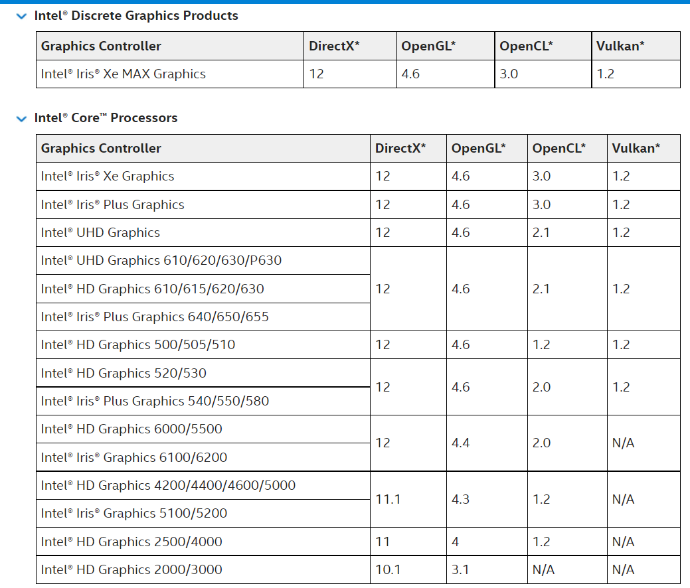
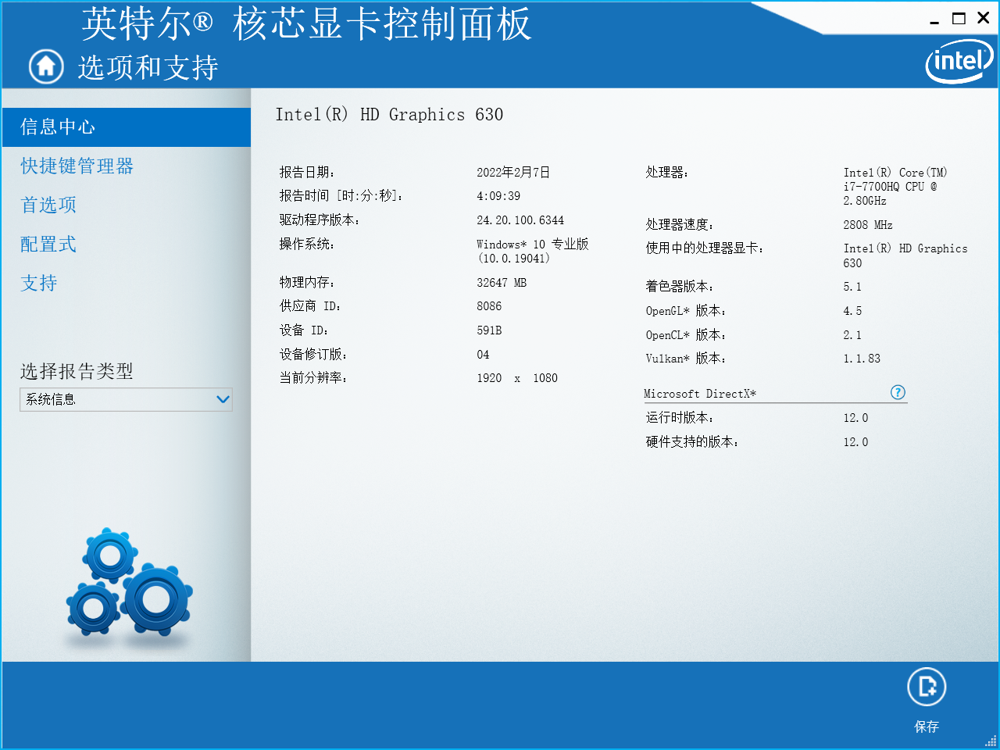

# 核心模式

---

# 介绍

据[wiki](https://www.khronos.org/opengl/wiki/OpenGL_Context#Context_types),
`Core Profile(核心模式)`的引入是因为在OpenGL3.0,引入了废弃函数的感念  
虽然在Opengl3.1就移除了就大多数过时的API,但是许多实现仍然支持废弃和被移除的动能  
所以OpenGL提供了一种获取兼容指定版本的OpenGL的方法  
并且上下文类型也由此分为两种模式(Profile):  
`Core Profile(核心模式)`和`CompatibilityProfile(兼容模式)`

可以通过`GLFW.glfwWindowHint`来指定

> [!note]
> 这个函数还可以指定一些别的参数  
> 可以参考lwjgl的[javadoc](https://javadoc.lwjgl.org/org/lwjgl/glfw/GLFW.html#glfwWindowHint(int,int))
> 或glfw的[docs](https://www.glfw.org/docs/latest/window_guide.html#window_hints_ctx)

> [!note]
> 可以请求的OpenGL版本可以在[这里](https://www.khronos.org/registry/OpenGL/index_gl.php)看到  
> 每一个规范都代表了一个版本

# 切换

修改一下初始化代码

````kotlin
init()

GLFW.glfwWindowHint(GLFW.GLFW_CONTEXT_VERSION_MAJOR,4)
GLFW.glfwWindowHint(GLFW.GLFW_CONTEXT_VERSION_MINOR,6)
GLFW.glfwWindowHint(GLFW.GLFW_OPENGL_PROFILE,GLFW.GLFW_OPENGL_CORE_PROFILE)
GLFW.glfwWindowHint(GLFW.GLFW_OPENGL_FORWARD_COMPAT,GLFW.GLFW_FALSE)

val window = createWindow(900, 900, "rua")
GLFW.glfwMakeContextCurrent(window)
GL.createCapabilities()
````

再次运行我们的代码

````
FATAL ERROR in native method: Thread[main,5,main]: No context is current or a function that is not available in the current context was called. The JVM will abort execution.
````

发生什么了?  
经过一番查找 java启动后被默认分配为集成显卡  
在笔者的电脑上为i7-7700HQ附带的Intel(R)HD Graphics 630  
查阅[Intel文档](https://www.intel.com/content/www/us/en/support/articles/000005524/graphics.html)  

但是  
  
在设备管理器检查了显卡驱动,是最新的  
总之如果你也出现了上述的错误,可以查看一下你的显卡是否支持指定的OpenGL版本  
所以我们切换成独立显卡试试

> [!attention]
> 获取的版本一定是兼容我们要求的版本,但不一定是指定的版本  
> 也就是说,我们会获取到比要求更高的版本  
> 如果要测试你所在的平台能支持的最大版本,应由高到低进行测试  
> 如果错误出现,会在glfwCreateWindow调时出现
> > GLFW_CONTEXT_VERSION_MAJOR and GLFW_CONTEXT_VERSION_MINOR specify the client API version that the created context must be compatible with. The exact behavior of these hints depend on the requested client API.  
> 摘自[glfw docs](https://www.glfw.org/docs/latest/window.html#window_hints)

````
FATAL ERROR in native method: Thread[main,5,main]: No context is current or a function that is not available in the current context was called. The JVM will abort execution.
	at org.lwjgl.opengl.GL11.glBegin(Native Method)
	at zomb_676.cobalt.grahic.MainKt.main(Main.kt:27)
	at zomb_676.cobalt.grahic.MainKt.main(Main.kt)
````

错误仍然存在,但是好像变了?  
根据栈信息查询函数信息

````java
/**
 * Begins the definition of vertex attributes of a sequence of primitives to be transferred to the GL.
 *
 * @param mode the primitive type being defined. One of:<br><table><tr><td>{@link #GL_POINTS POINTS}</td><td>{@link #GL_LINE_STRIP LINE_STRIP}</td><td>{@link #GL_LINE_LOOP LINE_LOOP}</td><td>{@link #GL_LINES LINES}</td><td>{@link #GL_TRIANGLE_STRIP TRIANGLE_STRIP}</td><td>{@link #GL_TRIANGLE_FAN TRIANGLE_FAN}</td><td>{@link #GL_TRIANGLES TRIANGLES}</td></tr><tr><td>{@link GL32#GL_LINES_ADJACENCY LINES_ADJACENCY}</td><td>{@link GL32#GL_LINE_STRIP_ADJACENCY LINE_STRIP_ADJACENCY}</td><td>{@link GL32#GL_TRIANGLES_ADJACENCY TRIANGLES_ADJACENCY}</td><td>{@link GL32#GL_TRIANGLE_STRIP_ADJACENCY TRIANGLE_STRIP_ADJACENCY}</td><td>{@link GL40#GL_PATCHES PATCHES}</td><td>{@link #GL_POLYGON POLYGON}</td><td>{@link #GL_QUADS QUADS}</td></tr><tr><td>{@link #GL_QUAD_STRIP QUAD_STRIP}</td></tr></table>
 * 
 * @see <a target="_blank" href="http://docs.gl/gl3/glBegin">Reference Page</a> - <em>This function is deprecated and unavailable in the Core profile</em>
 */
public static native void glBegin(@NativeType("GLenum") int mode);
````

可以看到最后一行
> This function is deprecated and unavailable in the Core profile

将

````kotlin
GLFW.glfwWindowHint(GLFW.GLFW_OPENGL_PROFILE,GLFW.GLFW_OPENGL_CORE_PROFILE)
GLFW.glfwWindowHint(GLFW.GLFW_OPENGL_FORWARD_COMPAT,GLFW.GLFW_FALSE)
````

改为

````kotlin
GLFW.glfwWindowHint(GLFW.GLFW_OPENGL_PROFILE,GLFW.GLFW_OPENGL_FORWARD_COMPAT)
GLFW.glfwWindowHint(GLFW.GLFW_OPENGL_FORWARD_COMPAT,GLFW.GLFW_TRUE)
````

理论上能够使报错消失  
但正如wiki所说[**compatibility is not guaranteed to be available(兼容并不被保证)**](https://www.khronos.org/opengl/wiki/OpenGL_Context#Context_types)

再我们讲述如何在`Core Profile`下渲染一个简单的三角形前

我们先介绍一下LWJGL中内存相关的操作