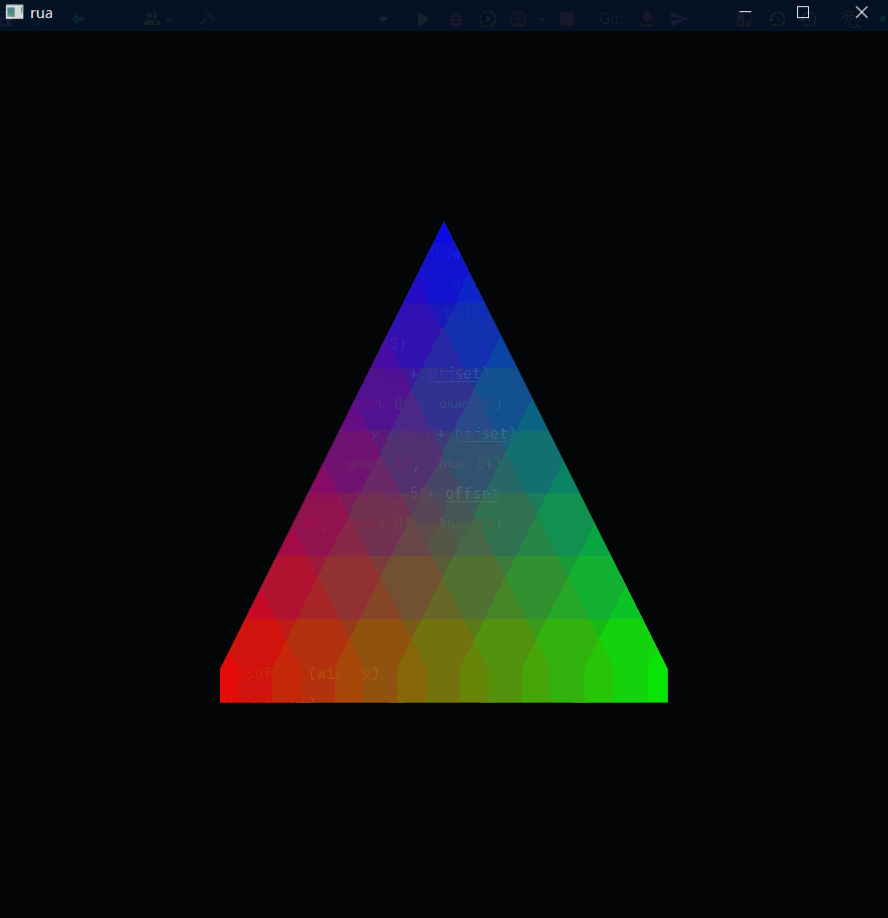

# 立即模式

---

## 一些补充

`GLFW.glfwWindowShouldClose(window)`用于判断窗口是否需要关闭  
与他配套使用的是`GLFW.glfwPollEvents()`,用于处理所有待办事件 例如窗口移动,调整窗口大小,窗口关闭  
也就是说,如果不调用`glfwPollEvents()`,`glfwWindwosShouldClose(window)`是不会返回的true的

`GL11.glBegin(mode)`和`GL11.glEnd()`成对调用 前者表示开始收集数据,后者表示停止收集

## 顶点

`GL11.glVertex2f(x,y)`和`GL11.glColor3f(r,g,b)`用于提交所谓的顶点数据  
`顶点`可以理解为空间中点的信息的集合,可以包含坐标,颜色等信息

有了点,又通过`GL11.glBegin(mode)`的mode指定的,就我们就得到了一个个的形状  
这一个个形状称之为`primitive(图元)`,将点变为图元的过程称之为`shape assembly(图元装配)`

绘制好后,我们需要调用`GLFW.glfwSwapBuffers(window)`  
将绘制好的内容交换到屏幕上显示出来  
因为画面不是一瞬间绘制出来的,通过双缓冲,可以避免图像闪烁

`GL11.glClear(GL11.GL_COLOR_BUFFER_BIT)`会清除画布上的内容 否则就会这样(色块感是因为gif只有256色)
<details>
<summary>click to unfold</summary>


</details>

<details>
<summary>code</summary>

````kotlin
var offset  = 0f.toFloat()
while (!GLFW.glfwWindowShouldClose(window)) {
    //GL11.glClear(GL11.GL_COLOR_BUFFER_BIT)

    GL11.glBegin(GL11.GL_TRIANGLES)
    GL11.glVertex2f(0f, 0.5f + offset)
    GL11.glColor3f(1f, 0f, 0f)
    GL11.glVertex2f(-0.5f, -0.5f+ offset)
    GL11.glColor3f(0f, 1f, 0f)
    GL11.glVertex2f(0.5f, -0.5f+ offset)
    GL11.glColor3f(0f, 0f, 1f)
    GL11.glEnd()

    offset+=0.001f

    GLFW.glfwSwapBuffers(window)
    GLFW.glfwPollEvents()
}
````

</details>  

> ![!note]
> 有些内容暂且按下不表  
> 为何glVertex2f中传入的参数都在-1\~1 (不严格)  
> 为何glColor3f中传入的参数为0\~1

从上我们不难发现绘制的过程可以这样表示,我们需要做的仅仅是其中的第一部分

````mmd
flowchart LR
    收集顶点数据 --> 图元装配 --> 绘制
````

这种绘制的流程称之为**Immediate Mode(立即模式)**  
它的优点成为了它的缺点,它太过简单,也太缺乏灵活行(不可配置),我们无法控制其中的其他部分,也缺乏性能  
Stack Over Flow上[有篇](https://stackoverflow.com/questions/6733934/what-does-immediate-mode-mean-in-opengl)
相关内容

而与之相对而言对立的概念称之为**Core Profile(核心模式)**

> ![!note]
> 立即模式已经过时  
> 本文使用仅仅为了能让读者尽早写出一个程序  
> 并且对顶点有一个粗浅的认识