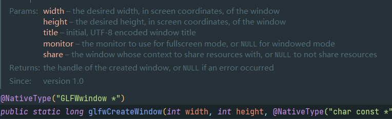
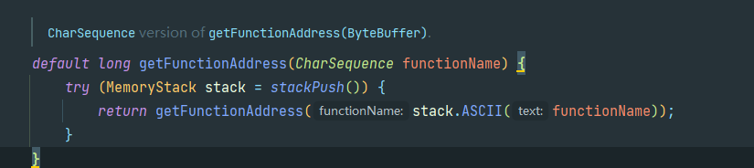
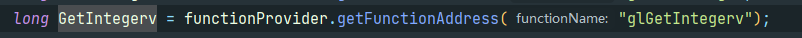
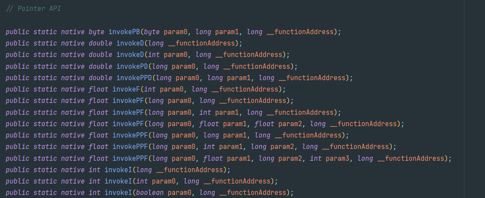
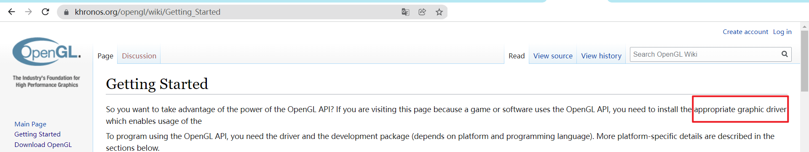
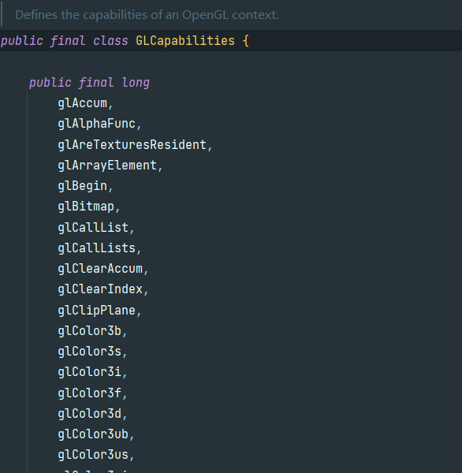
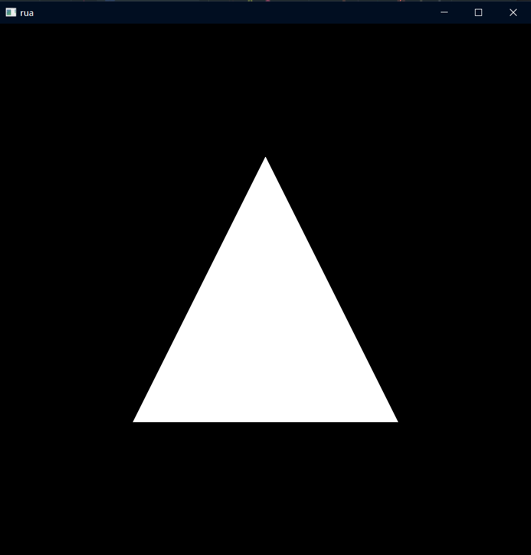

# 初试

---

## 大致流程

我们的目标是

````mmd
flowchart LR
    绘制画面
````

但是在此之前我们要初始化opengl,在窗口关闭后要进行收尾

````mmd
flowchart LR
    初始化opengl --> 绘制画面 --窗口关闭--> 收尾
````

画面每帧都有可能变化,所以我们要不断更新画面

````mmd
flowchart LR
    初始化opengl --> 绘制画面 --窗口关闭--> 收尾
    绘制画面 --更新画面--> 绘制画面
````

## 初始化opengl

调用`GLFW.glfwInit():boolean`  
返回true为成功,false为失败 所以我们可以这样

````kotlin
@Throws(RuntimeException::class)
fun init() {
    if (!GLFW.glfwInit()) {
        throw RuntimeException("failed to init glfw")
    }
}
````

然后调用即可

---

调用`GLFW.glfwCreateWindow(int width, int height,CharSequence title,long monitor,long share)`  
来创建窗口  
`monitor`和`share`可以传入`MemoryUtil.NULL`  
`MemoryUtil.NULL`查定义可知就是0L,只不过这样可读性更高,在kt也不会报错


封装一下

````kotlin
fun createWindow(width: Int, height: Int, title: String): Long =
    GLFW.glfwCreateWindow(width, height, title, MemoryUtil.NULL, MemoryUtil.NULL)
````

调用

````kotlin
val window = createWindow(900, 900, "rua")
````

---
调用`glfwMakeContextCurrent(long window)`
使得我们刚才创建的那个窗口的opengl上下文(状态)处在当前线程  
一个线程有且仅有一个opengl上下文且在设置新的上下文前,旧的必须被移除  
如果不太清楚什么是Context(上下文)的话,可以理解为opengl的一堆状态的合集

> An OpenGL context represents many things. A context stores all of the state associated with this instance of OpenGL  
> 摘自wiki[OpenGL context](https://www.khronos.org/opengl/wiki/OpenGL_Context)的开头

---

调用`GL.createCapabilities()`  
具体是在获取我们需要用到的opengl函数的实际地址

  
然后通过获取的函数的地址来调用真正的函数

**因为opengl只是规范!!真正的函数实现在显卡驱动内**

只能通过函数的地址来间接调用函数 这里的capabilities具体可以在这里找到


---

调用`GLFW.glfwMakeContextCurrent(window)`  
把Capabilities绑定到当前线程 如果忘记保存之前的window handle  
可以调用`GLFW.glfwGetCurrentContext()`获取当前线程的window handle

````kotlin
GLFW.glfwMakeContextCurrent(window)
````

---

## 收尾

在我们正式开始渲染前,我们首先处理收尾工作

调用`GLFW.glfwDestroyWindow(window)`  
关闭窗口和它的上下文 调用`GLFW.glfwTerminate()`  
终止GLFW库的剩余内容

````kotlin
GLFW.glfwDestroyWindow(window)
GLFW.glfwTerminate()
````

---

## 初次绘制

>[!note]
>这里只是概览,下一章将会详细解释

写下我们的绘制循环

````kotlin
while(!GLFW.glfwWindowShouldClose(window)){
    GL11.glClear(GL11.GL_COLOR_BUFFER_BIT)
    //draw logic
    GLFW.glfwSwapBuffers(window)
    GLFW.glfwPollEvents()
}
````

先绘制一个普普通通的三角形吧

````kotlin
GL11.glBegin(GL11.GL_TRIANGLES)
GL11.glVertex2f(0f, 0.5f)
GL11.glVertex2f(-0.5f, -0.5f)
GL11.glVertex2f(0.5f, -0.5f)
GL11.glEnd()
````

  
修改一下,来点色彩

````kotlin
GL11.glBegin(GL11.GL_TRIANGLES)
GL11.glColor3f(1f, 0f, 0f)
GL11.glVertex2f(0f, 0.5f)
GL11.glColor3f(0f, 1f, 0f)
GL11.glVertex2f(-0.5f, -0.5f)
GL11.glColor3f(0f, 0f, 1f)
GL11.glVertex2f(0.5f, -0.5f)
GL11.glEnd()
````

  
很好!