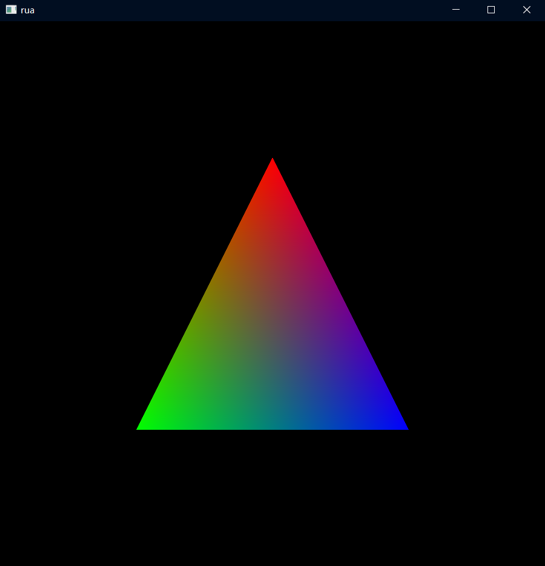

# 初试

---

调用`GLFW.glfwInit():boolean`  
返回true为成功,false为失败 所以我们可以这样

````kotlin
@Throws(RuntimeException::class)
fun init() {
    if (!GLFW.glfwInit()) {
        throw RuntimeException("failed to init glfw")
    }
}
````

然后调用即可

---

调用`GLFW.glfwCreateWindow(int width, int height,CharSequence title,long monitor,long share)`  
来创建窗口  
`monitor`和s`hare`可以传入`MemoryUtil.NULL`  
`MemoryUtil.NULL`查定义可知就是0L,只不过这样可读性更高,在kt也不会报错


````kotlin
val window = createWindow(900, 900, "rua")
````

---
调用`glfwMakeContextCurrent(long window)`
使得我们刚才创建的那个窗口的opengl上下文(状态)处在当前线程  
一个线程有且仅有一个opengl上下文且在设置新的上下文前,旧的必须被移除  
如果不太清楚什么是上下文(Context)的话,可以理解为opengl的一堆状态的合集

---

调用`GL.createCapabilities()`  
具体是在获取我们需要用到的opengl函数的实际地址


然后通过获取的函数的地址来调用真正的函数

因为opengl只是规范!!真正的函数实现在显卡驱动内

只能通过函数的地址来间接调用函数
这里的capabilities具体可以在这里找到


---

调用`GLFW.glfwMakeContextCurrent(window)`  
把Capabilities绑定到当前线程
如果忘记保存之前的window handle  
可以调用GLFW.glfwGetCurrentContext()获取当前线程的window handle

---

终于我们完成了所有的初始化工作
在我们正式开始渲染前,我们首先处理收尾工作

调用`GLFW.glfwDestroyWindow(window)`  
关闭窗口和它的上下文
调用`GLFW.glfwTerminate()`  
终止GLFW库的剩余内容

---
这一章已经很长了,为了不太扫兴我们先绘制点什么吧  

写下我们的绘制循环
````kotlin
while(!GLFW.glfwWindowShouldClose(window)){
    //draw logic
    GLFW.glfwSwapBuffers(window)//ignore it
    GLFW.glfwPollEvents()//ignore it
}
````

先绘制一个普普通通的三角形吧
````kotlin
GL11.glBegin(GL11.GL_TRIANGLES)
GL11.glVertex2f(0f, 0.5f)
GL11.glVertex2f(-0.5f, -0.5f)
GL11.glVertex2f(0.5f, -0.5f)
GL11.glEnd()
````
  
来点彩色  
````kotlin
GL11.glBegin(GL11.GL_TRIANGLES)
GL11.glColor3f(1f, 0f, 0f)
GL11.glVertex2f(0f, 0.5f)
GL11.glColor3f(0f, 1f, 0f)
GL11.glVertex2f(-0.5f, -0.5f)
GL11.glColor3f(0f, 0f, 1f)
GL11.glVertex2f(0.5f, -0.5f)
GL11.glEnd()
````

很好!