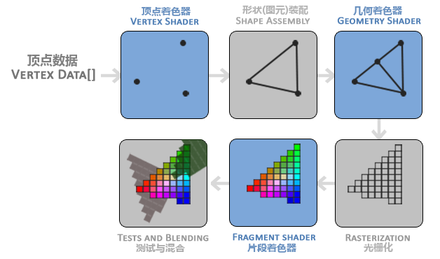

# 三角形,又一次?

> [!note]
> 本章较长,请耐心观看

[上文](explainImmediateMode.md)我们提到的渲染流程为

````mmd
flowchart LR
    收集顶点数据 --> 图元装配 --> 绘制
````

但要切换到`Core Profile`,我们要修改一下

````mmd
flowchart LR
    收集顶点数据 --> 处理顶点数据 --> 图元装配 --> 处理像素 -->绘制
````

换用专用的术语,修改一下流程

````mmd
flowchart LR
    VertexPuller --> VertexShader(顶点着色器) --> 图元装配 --> FragmentShader(片元/片段着色器) --> DrawCall  
````

> [!note]
> 上图简化自  
> 
> 出自opengl规范4.6 35页
> 为了便于理解以及没有想到更好的办法就翻译成上文了

  
引用自LearnOpenglCN  

`Shader(着色器)`,[定义]([参考自](https://www.khronos.org/opengl/wiki/Shader))
为用户编写的运行在GPU上的程序<option>和`光影`关系其实不大,虽然`着色器`这个翻译也一样</option>

# Vertex Buffer Object

之前提到,我们需要将顶点数据提交到显卡来绘制我们所需的对象  
而在`Core Profile`模式下,提交顶点数据方法由`glVertex2f` `glColor3f `  
修改为`VBO`即    
`Vertex Buffer Object(顶点缓冲对象)`用于存储将要发送给GPU的数据

````java
/**
* Generates buffer object names.
* 
* @see <a target="_blank" href="http://docs.gl/gl4/glGenBuffers">Reference Page</a>
*/
NativeType("void")
public static int glGenBuffers() {
   return GL15C.glGenBuffers();
}
````

创建VBO,返回值为所创建VBO的索引,在参数形参名中有时称之为的name  

````java
/**
 * Binds a named buffer object.
 *
 * @param buffer the name of a buffer object
 * 
 * @see <a target="_blank" href="http://docs.gl/gl4/glBindBuffer">Reference Page</a>
 */
public static void glBindBuffer(@NativeType("GLenum") int target, @NativeType("GLuint") int buffer) {
    GL15C.glBindBuffer(target, buffer);
}
````

用于将指定的VBO绑定到当前上下文

> [!note]
> 在OpenGl中,我们上文产生的VBO对象称之为Buffer Objects  
> 里面可以存储各种不同的类型数据,包括但不仅限于顶点数据,详见[wiki](https://www.khronos.org/opengl/wiki/Buffer_Object)
> 数据的类型通过target指定,这里我们使用`GL_ARRAY_BUFFER`

<!-- tabs:start -->

#### **JVM**

````kotlin
val vbo: Int =GL43.glGenBuffers()
    .also { GL43.glBindBuffer(GL43.GL_ARRAY_BUFFER, it) }
````

#### **Memory Stack**

````kotlin
val vbo = MemoryStack.stackPush().use {
    val point = it.mallocInt(0)
    GL43.glGenBuffers(point)
    point.get(0)
 }
````

<!-- tabs:end -->

# Allocate Memory on ram

<!-- tabs:start -->

#### **JVM**

````kotlin
 val data: FloatArray = floatArrayOf(
     0f, 0.5f, 1f, 0f, 0f,
     -0.5f, -0.5f, 0f, 1f, 0f,
     0.5f, -0.5f, 0f, 0f, 1f
 )
````

#### **Native**

````kotlin
val data: FloatBuffer = MemoryUtil.memAllocFloat(15).apply {
    put(0f).put(0.5f).put(1f).put(0f).put(0f)
    put(-0.5f).put(-0.5f).put(0f).put(1f).put(0f)
    put(0.5f).put(-0.5f).put(0f).put(0f).put(1f)
    flip()
}
````

> [!note]
> 注意flip不能省

<!-- tabs:end -->

# Upload Data

通过

````java
public static void glBufferData(int target,FloatBuffer/float[] data,int usage) {
    GL15C.glBufferData(target, data, usage);
}
````

`target`与上文相同,代表Buffer Object内数据的类型,此处同样填入`GL_ARRAY_BUFFER`  
`data`即数据在RAM上的容器两种方式分配的内存都有对应的重载

> [!note]
> 这里的data也可以给一个MemoryUtil.NONE  
> 在之后再提供数据

`usage`指你与OpenGL**约定**你将如何使用/访问分配的缓存   
有`Draw` `READ` `COPY`表示你会如何访问  
有`STATIC` `DYNAMIC` `STREAM`表示修改数据的频次

> [!note]
> usage仅为约定,并不代表实际如何使用  
> 仅仅用于指示OpenGL用于优化  
> 比如:指定`DYNAMIC/STREAM`也行会比`STATIC`为你分配更高速的显存

这里我们

````kotlin
GL43.glBufferData(GL43.GL_ARRAY_BUFFER, data, GL43.GL_STATIC_DRAW)
````

# Vertex Shader

在`Vertex Shader`,我们将获得我们提交的顶点数据    
并且在这一步决定每一个顶点在屏幕上所处的位置  
并且将数据传给下一步,即为`Fragment Shader`

````glsl
#version 460 core

layout (location = 0) in vec2 pos;
layout (location = 1) in vec3 m_color;

out vec3 color;

void main(){
    color = m_color;
    gl_Position = vec4(pos,0.5f,1.0f);
}
````

`#version 460 core`用于显示指定版本

`layout (location = 0) in vec2 pos;`  
`layout (location = 1) in vec3 m_color;`  
指定了我们输入数据的结构

> [!note]
> 这种指定方式被称之为`In-shader specification`  
> 有另一种在非glsl中指定的方式为`Pre-link specification`  
> 当然,还有缺省方法为`Automatic assignment`  
> 在`Fragment Shader`中同理
> 在[wiki](https://www.khronos.org/opengl/wiki/Vertex_Shader#Input)
> 有详细的介绍

`layout`为关键字
`in`代表数据为输入,在`Vertex Shader`即为我们提交的数据

| slot  | code          | type     | code | variable         | code    |
|-------|---------------|----------|------|------------------|---------|
| 指定槽位0 | location = 0  | 二维浮点类型向量 | vec2 | 指定对应的变量名为pos     | pos     |
| 指定槽位1 | location = 1  | 三位浮点类型向量 | vec3 | 指定对应的变量名为m_color | m_color |

`out vec3 color;`代表我们输出的数据

对输出而言,并不存在槽位的概念  
`color` 代表输出变量名,需与`Fragment Shader`内的输入变量名一致

````glsl
void main(){
//do xxx
}
````

`color = m_color;`将输入变量m_color赋值给输出变量`color`

`gl_Position = vec4(pos,0.5f,1.0f);`

`gl_Position`是OpenGL的一个内建变量  
表示了对应顶点输出到`clip-space(剪切/裁剪空间)`的位置
`vec4`可理解为一个接收四个参数,返回一个vec4的函数  
但由于[`Swizzling(重组)`](https://www.khronos.org/opengl/wiki/Data_Type_(GLSL)#Swizzling)
特性的存在,我们可以这样很很方便只传两个参数

# Swizzling

假设我们有`vec4 v`和`vec2 v2`
那么其中的各个分量依次可以为  
`v.x` `v.y` `v.z` `v.w`  
`v.r` `v.g` `v.b` `v.a`(color)  
`v.s` `v.t` `v.p` `v.q`(texture coordinates)

`xyzw` `rgba` `stpq` 均等效

那么    
`v.xy = vec2(v.x,x.y)`    
`v.xzw = vec3(v.x,v.z,v.w)`  
`v.xx = vec2(v.x,v.x)`

`vec4(v.xz,v2.x,v2.y) = vec4(v.xz,v2)`

# Fragment Shader

> [!note]
> 这是一个[可选](https://www.khronos.org/opengl/wiki/Fragment_Shader#Optional) Shader  
> 但是如果不指定的画,我们是无法指定内容的

在`Fragment Shader`中,我们将决定每一个像素的颜色  
我们可以从这里接收到来自顶点着色器的输出作为输入

````glsl
#version 460 core

in vec3 color;

out vec4 FragColor;

void main(){
    FragColor = vec4(color,1.0f);
}
````

`in vec3 color`在这里等价于`layout (location = 0 ) vec3 color`  
前者的写法是由于利用了`Automatic assignment`  
`Fragment Shader`是可以拥有多个输出的

这里的vec4指代的是red,green,blue,alpha

# Vertex Attribute

`Vertex Attribute(顶点属性)`即我们前文一直所说的顶点格式/结构

需要与`Vertex Shader`中`layout`相对应

````java
glVertexAttribPointer(int index,int size,int type,bool normalized,int stride long pointer)
````

用于指定`Vertex Attrubute`

> [!note]  
> 它有几个几乎同名的方法  
> `glVertexAttribIPointer`  
> `glVertexAttribPointer`  
> `glVertexAttribLPointer`   
> 它们的区别仅在于允许使用的`type`参数不同  
> 以及使用的VBO的数据的类型不同  
> 具体见[wiki](https://docs.gl/gl4/glVertexAttribPointer)

`index(索引)`即前文所指槽位,与`layout (location = n)`中的n应保持一致  
`size`指有变量的维数/数量,`float<=>1`,`vec2<=>2`,`vec3<=>3`,`vec4<=>4`  
`type`即float,int等
`normalized`指数据是否已经被`标准化`,将会在后续章节详细介绍  
`stride(步长?)`,指一个顶点数据的总长度,以字节为单位  
`pointer`是指第一个数据相对起始地址的偏移量,也以字节为单位

指定完成需要使用
`glEnableVertexAttribArray(int index)`来开启  
`glDisableVertexAttribArray(int index)`与之对应

````kotlin
GL43.glVertexAttribPointer(0, 2, GL43.GL_FLOAT, true, TypeSize.float * 5, 0)
GL43.glEnableVertexAttribArray(0)
GL43.glVertexAttribPointer(1, 3, GL43.GL_FLOAT, true, TypeSize.float * 5, (TypeSize.float * 2).toLong())
GL43.glEnableVertexAttribArray(1)
````

<details>
<summary>TypeSize</summary>

简单编写的用于计算类型字节大小的代码

````kotlin
@JvmInline
value class TypeSize<T : Number> private constructor(val byteSize: Int) {
    companion object {
        val int = TypeSize<Int>(Int.SIZE_BYTES)
        val float = TypeSize<Float>(Float.SIZE_BYTES)
        val double = TypeSize<Double>(Double.SIZE_BYTES)
        val long = TypeSize<Long>(Long.SIZE_BYTES)
        val short = TypeSize<Short>(Short.SIZE_BYTES)
        val byte = TypeSize<Byte>(Byte.SIZE_BYTES)
    }

    operator fun times(num: Int): Int = byteSize * num
    infix fun size(num: Int): Int = byteSize * num

    operator fun get(num: Int): TypeSize<T> = TypeSize(byteSize * num)
    infix fun multi(num: Int): TypeSize<T> = TypeSize(byteSize * num)
}
````

</details>

# Vertex Array Object

````java
glDrawArrays(@NativeType("GLenum") int mode, @NativeType("GLint") int first, @NativeType("GLsizei") int count)
````

`first` `count` 代表从第几个顶点起绘制几个几点

`GL43.glDrawArrays(GL43.GL_TRIANGLES, 0, 3)`运行!  
em-mm?一篇黑屏?

这是因为我们缺少了对于`Vertex Array Object(顶点数组对象的配置)`  
里面包含了`Vertex Format`,`Vertex Buffer Object`的相关配  
在`core profile`下,若不指定  
将会抛出错误`GL_INVALID_OPERATION error generated. Array object is not active.`
错误级别为`GL_DEBUG_TYPE_ERROR`

如果你不指定GLFWWindowHint的画是可以正常运行的  
OpenGL会帮你创建一个默认的VAO

`glGenVertexArrays` `glBindVertexArray` `glDeleteVertexArrays` `GL43.glIsVertexArray`  
用于生成,绑定,删除,判断VAO

> [!note]
> 大部分OpenGL对象都拥有与之相似的  
> `glGenXXX` `glBindXXX` `glDeleteXXX` `glIsXXX`  
> `Buffer Object`用于是一个`generic(通用)`的容器,所以参数会有所不同

VBO有两种与之配套的使用方式,具体依据你对数据的绑定时机不同而作区分

## Way1

与上文相同,即`glVertexAttribPointer`,但是这里我们补充下细节

上文说到,VAO中绑定了与VBO有关的信息  
在调用`glVertexAttribPointer`时  
会对应当前上下文中所绑定的`VBO`即`GL_ARRAY_BUFFER`  
如果在调用时,上下文中尚未绑定`VBO`

就会引发JVM崩溃...

````plaintext
#
# A fatal error has been detected by the Java Runtime Environment:
#
#  EXCEPTION_ACCESS_VIOLATION (0xc0000005) at pc=0x00007ffc874d71b0, pid=19340, tid=9784
#
# JRE version: OpenJDK Runtime Environment (17.0.1+12) (build 17.0.1+12-39)
# Java VM: OpenJDK 64-Bit Server VM (17.0.1+12-39, mixed mode, sharing, tiered, compressed oops, compressed class ptrs, g1 gc, windows-amd64)
# Problematic frame:
# C  [nvoglv64.dll+0xbf71b0]
#
# No core dump will be written. Minidumps are not enabled by default on client versions of Windows
#
# An error report file with more information is saved as:
# C:\github\Cobalt\hs_err_pid19340.log
#
# If you would like to submit a bug report, please visit:
#   https://bugreport.java.com/bugreport/crash.jsp
# The crash happened outside the Java Virtual Machine in native code.
# See problematic frame for where to report the bug.
#
````

从`EXCEPTION_ACCESS_VIOLATION (0xc0000005)`可以?推测出应该时`Null Pointer Exception`了

所以,从绑定的时机,不难推测,一个`VAO`的每个`Vertex Attribute`可以来自不同的`VBO`

## Way2

Way1的方法有一个问题:  
他将[两件事同时在一起做了](https://www.khronos.org/opengl/wiki/Vertex_Specification#Vertex%20Buffer%20Object) 即
`指定Vertex Attribute`和`指定VBO`  
通过Way2,就可以将这两件事单独指定

````java
public static void glVertexAttribFormat(int attribindex,int size,int type,boolean normalized,int stride,int relativeoffset)
````

`attribueindex`与原本使用的函数`glVertexAttribPointer`的参数`index`同义  
即为`Vertex Shader`中`layout (location = n)`中的n  
`relativeoffset`与`glVertexAttribPointer`的参数`pointer`相似

这个函数仅仅指定了`Vertex Shader`特定槽位/索引`的`Vertex Attribute`  
而这个设置的`index`

````java
public static void glBindVertexBuffer(int bindingindex,int buffer,long offset,int stride) {
````

`buffer`指的就是我们绑定的`VBO`的name/id  
`stride`仍指单个顶点的长度,以字节为单位  
`offset`仍指开始读取第一个顶点数据前的起始偏移

`bingingindex`是用于链接`VBO`和`Vertex Attribute`

而链接的方法则是

````java
glVertexAttribBinding(int attributeindex,int binding index)
````

相同`bindingindex`即绑定在一起了

所以代码变成了

````kotlin
GL43.glEnableVertexAttribArray(0)
GL43.glVertexAttribFormat(0,2,GL43.GL_FLOAT,true,0)
GL43.glVertexAttribBinding(0,1)

GL43.glEnableVertexAttribArray(1)
GL43.glVertexAttribFormat(1,3,GL43.GL_FLOAT,true,TypeSize.float * 2)
GL43.glVertexAttribBinding(1,1)

GL43.glBindVertexBuffer(1,vbo,0,TypeSize.float * 5)
````
