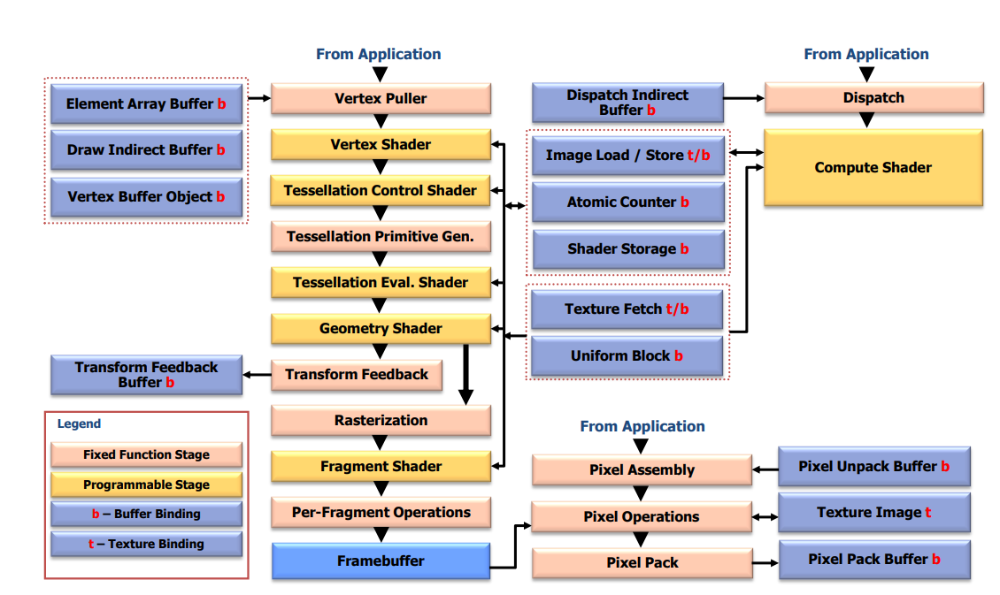

# 三角形,又一次?

> [!note]
> 本章较长,请耐心观看

[上文](explainImmediateMode.md)我们提到的渲染流程为

````mmd
flowchart LR
    收集顶点数据 --> 图元装配 --> 绘制
````

但要切换到`Core Profile`,我们要修改一下

````mmd
flowchart LR
    收集顶点数据 --> 处理顶点数据 --> 图元装配 --> 处理像素 -->绘制
````

换用专用的术语,修改一下流程

````mmd
flowchart LR
    VertexPuller --> VertexShader(顶点着色器) --> 图元装配 --> FragmentShader(片元/片段着色器) --> DrawCall  
````

> [!note]
> 上图简化自  
> 
> 出自opengl规范4.6 35页
> 为了便于理解以及没有想到更好的办法就翻译成上文了

`Shader(着色器)`,[定义]([参考自](https://www.khronos.org/opengl/wiki/Shader))
为用户编写的运行在GPU上的程序<option>和`光影`关系其实不大,虽然`着色器`这个翻译也一样</option>

# Vertex Buffer Object

`Vertex Buffer Object(顶点缓冲对象)`用于存储将要发送给GPU的数据

````java
/**
* Generates buffer object names.
* 
* @see <a target="_blank" href="http://docs.gl/gl4/glGenBuffers">Reference Page</a>
*/
NativeType("void")
ublic static int glGenBuffers() {
   return GL15C.glGenBuffers();
}
````

创建VBO,返回值为所创建VBO的索引,也称之为name

````java
/**
 * Binds a named buffer object.
 *
 * @param buffer the name of a buffer object
 * 
 * @see <a target="_blank" href="http://docs.gl/gl4/glBindBuffer">Reference Page</a>
 */
public static void glBindBuffer(@NativeType("GLenum") int target, @NativeType("GLuint") int buffer) {
    GL15C.glBindBuffer(target, buffer);
}
````

用于将指定的VBO绑定到当前上下文

> [!note]
> 在OpenGl中,我们上文产生的VBO载体称之为Buffer Objects  
> 里面可以存储各种不同的数据,详见[wiki](https://www.khronos.org/opengl/wiki/Buffer_Object)
> 数据的类型通过target指定,这里我们使用`GL_ARRAY_BUFFER`

<!-- tabs:start -->

#### **JVM**

````kotlin
val vbo: Int =GL43.glGenBuffers()
    .also { GL43.glBindBuffer(GL43.GL_ARRAY_BUFFER, it) }
````

#### **Memory Stack**

````kotlin
val vbo = MemoryStack.stackPush().use {
    val point = it.mallocInt(0)
    GL43.glGenBuffers(point)
    point.get(0)
 }
````

<!-- tabs:end -->

