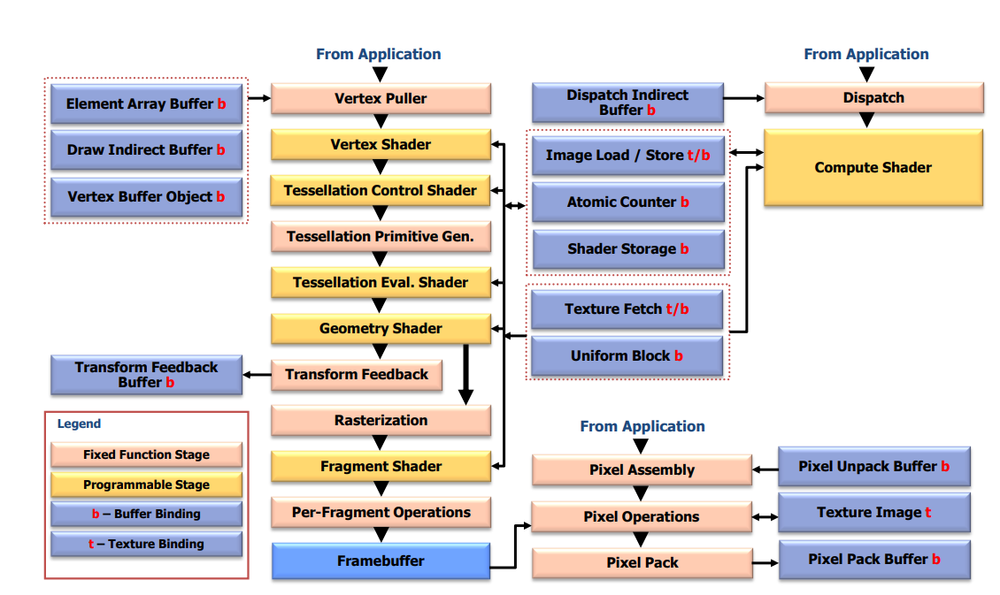

# 三角形,又一次?

> [!note]
> 本章较长,请耐心观看

[上文](explainImmediateMode.md)我们提到的渲染流程为

````mmd
flowchart LR
    收集顶点数据 --> 图元装配 --> 绘制
````

但要切换到`Core Profile`,我们要修改一下

````mmd
flowchart LR
    收集顶点数据 --> 处理顶点数据 --> 图元装配 --> 处理像素 -->绘制
````

换用专用的术语,修改一下流程  

````mmd
flowchart LR
    VertexPuller --> VertexShader(顶点着色器) --> 图元装配 --> FragmentShader(片元/片段着色器) --> DrawCall  
````


> [!note]
> 上图简化自  
> 
> 出自opengl规范4.6 35页
> 为了便于理解以及没有想到更好的办法就翻译成上文了

`Shader(着色器)`,[定义]([参考自](https://www.khronos.org/opengl/wiki/Shader))
为用户编写的运行在GPU上的程序<option>和`光影`关系其实不大,虽然`着色器`这个翻译也一样</option>

````glsl
    
````

```html
<p>This is a paragraph</p>
<a href="//docsify.js.org/">Docsify</a>
```

```bash
echo "hello"
```

```php
function getAdder(int $x): int 
{
    return 123;
}
```