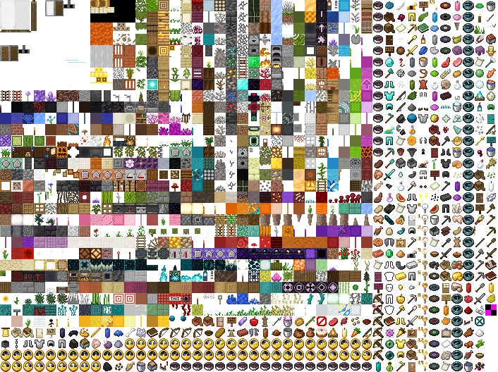

# TextureAtlas

---

mc在游戏加载期间,讲大量分散的贴图合并,用于`Batched Render`,加速渲染  
代码上对应类`net.minecraft.client.renderer.texture.TextureAtlas`  
本身即继承自`AbstractTexture`,证明其本身也是一张图片,这里列出`atlas/blocks`

而自身含有大量分散的贴图,则被抽象为`TextureAtlasSprite`,从中可以拿到`u0,u1,v0,v1`  
类型为float,表明其已是经过标准化的`uv坐标`  

`TextureAtlas`内有字段`Map<ResourceLocation, TextureAtlasSprite> texturesByName`  
`key`为材质对应的`ResourceLocation`  

部分`TextureAtlas`被`AtlasSet`所引用,而每一个`TextureAtlas`也有一个`ResourceLocation`作为其表征  
因此,`AtlasSet`可被视为`Map<ResourceLocation<Map<ResourceLocation,TextureAtlasSprite>>`  

| TextureAtlas stored by AtlasSet          | field name                  |
|------------------------------------------|-----------------------------|
| minecraft:textures/atlas/blocks          | BLOCK_ATLAS/LOCATION_BLOCKS |
| minecraft:textures/atlas/signs           | SIGN_SHEET                  |
| minecraft:textures/atlas/banner_patterns | BANNER_SHEET                |
| minecraft:textures/atlas/shield_patterns | SHIELD_SHEET                |
| minecraft:textures/atlas/chest           | CHEST_SHEET                 |
| minecraft:textures/atlas/beds            | BED_SHEET                   |
| minecraft:textures/atlas/shulker_boxes   | SHULKER_SHEET               |

其余部分的被`TextureAtlasHolder`的实现者持有  

| TextureAtlas                         | owner                   |
|--------------------------------------|-------------------------|
| minecraft:textures/atlas/mod_effects | MobEffectTextureManager |
| minecraft:textures/atlas/paintings   | PaintingTextureManager  |

例外

| TextureAtlas                         | owner                   |
|--------------------------------------|-------------------------|
| minecraft:textures/atlas/particles   | ParticleEngine          |

可通过`Minecraft`类下`Function<ResourceLocation, TextureAtlasSprite> getTextureAtlas(ResourceLocation pLocation)`拿到所需`TextureAtlasSprite`

## add  

mc会将被引用的材质自动添加,若想手动添加  

可订阅`TextureStitchEvent.Pre`  
通过`getAtlas()`拿到`TextureAtlas`,若对其添加`TextureAtlasSprite`,可调用`addSprite(ResourceLocation)`  

## animate texture  

`TextureAtlas`实现了`net.minecraft.client.renderer.texture.Tickable`  
最终会调用`TextureAtlasSprite$AnimatedTexture#tick`,内部调用`glPixelStorei`   

## 利用TextureAtlasHolder实现动态盔甲纹理

forge为item添加了如下方法`default String getArmorTexture(ItemStack stack, Entity entity, EquipmentSlot slot, String type)`  
通过这个方法，可实现为盔甲指定纹理,然而mc在渲染盔甲时,与渲染方块不同,并不使用类似于Atlas,而是直接使用纹理文件作为目标,此过程.mcmeta中指定的动画内容无效  
可通过委托TextureAtlasHolder,利用它帮助解析.mcmeta文件,然后手动移除mc在`TextureAtlas#getLoadedSprites`添加的`MissingTextureAtlasSprite`  
并且手动设置纹理大小,则在复写forge添加的返回的方法中,返回`TextureAtlasHolder`持有的`TextureAtlas`对象的`ResourceLocation`即可  

**注意`TextureAtlasHolder#getSprite`会修改你在`getResourcesToLoad`中提交的的委托的纹理路径**