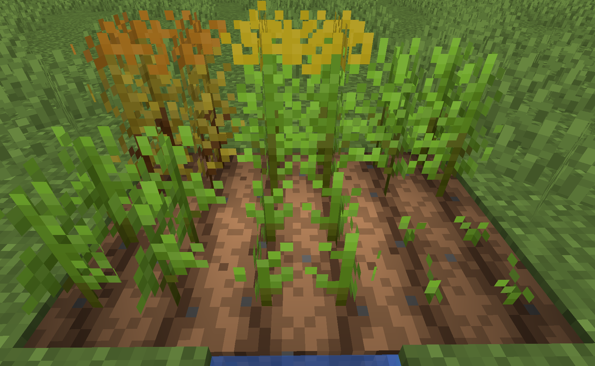
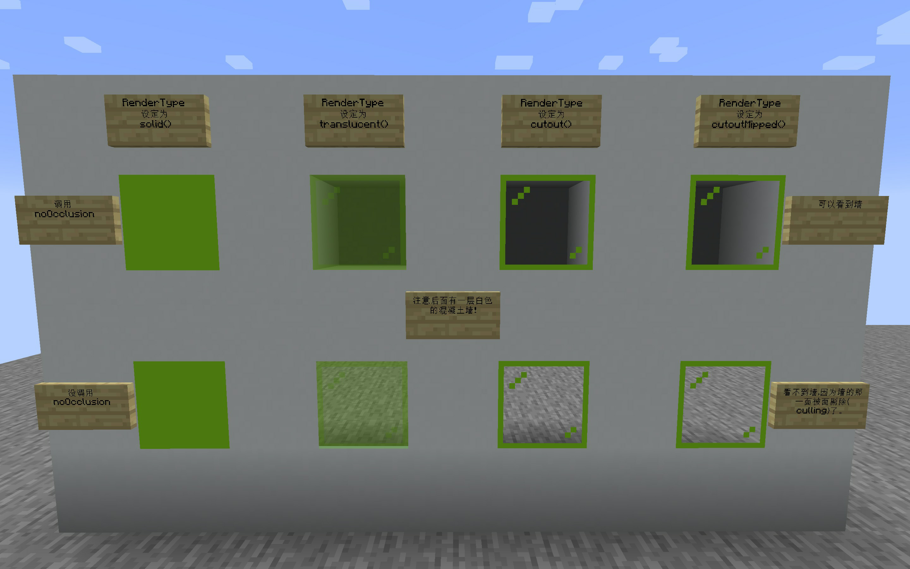

# BlockModel物品模型  

---

## JSON Model Structure  

方块的物品模型,与`json`模型相比更加之复杂,我们会阐释一下  

首先是`models/block/block.json`,定义了方块在不同`视角/TransformType`对应的变换参数

<details>
<summary>block.json</summary>

```json
{
    "gui_light": "side",
    "display": {
        "gui": {
            "rotation": [ 30, 225, 0 ],
            "translation": [ 0, 0, 0],
            "scale":[ 0.625, 0.625, 0.625 ]
        },
        "ground": {
            "rotation": [ 0, 0, 0 ],
            "translation": [ 0, 3, 0],
            "scale":[ 0.25, 0.25, 0.25 ]
        },
        "fixed": {
            "rotation": [ 0, 0, 0 ],
            "translation": [ 0, 0, 0],
            "scale":[ 0.5, 0.5, 0.5 ]
        },
        "thirdperson_righthand": {
            "rotation": [ 75, 45, 0 ],
            "translation": [ 0, 2.5, 0],
            "scale": [ 0.375, 0.375, 0.375 ]
        },
        "firstperson_righthand": {
            "rotation": [ 0, 45, 0 ],
            "translation": [ 0, 0, 0 ],
            "scale": [ 0.40, 0.40, 0.40 ]
        },
        "firstperson_lefthand": {
            "rotation": [ 0, 225, 0 ],
            "translation": [ 0, 0, 0 ],
            "scale": [ 0.40, 0.40, 0.40 ]
        }
    }
}

```

</details>

然后对于普通的六面方块来说,都来直接或间接来自`models/block/cube.json`  

```json
{
    "parent": "block/block",
    "elements": [
        {   "from": [ 0, 0, 0 ],
            "to": [ 16, 16, 16 ],
            "faces": {
                "down":  { "texture": "#down", "cullface": "down" },
                "up":    { "texture": "#up", "cullface": "up" },
                "north": { "texture": "#north", "cullface": "north" },
                "south": { "texture": "#south", "cullface": "south" },
                "west":  { "texture": "#west", "cullface": "west" },
                "east":  { "texture": "#east", "cullface": "east" }
            }
        }
    ]
}
```

这里比较特殊的是`texture`后面的`#down` `#up`等,将会查找自将继承此模型的模型,比如`models/block/cube_all.json`  

```json
{
    "parent": "block/cube",
    "textures": {
        "particle": "#all",
        "down": "#all",
        "up": "#all",
        "north": "#all",
        "east": "#all",
        "south": "#all",
        "west": "#all"
    }
}
```

其他非普通六面的模型,则定义其`elements`,如台阶  

<details>
<summary>stair.json</summary>

```json
{   "parent": "block/block",
    "display": {
        "gui": {
            "rotation": [ 30, 135, 0 ],
            "translation": [ 0, 0, 0],
            "scale":[ 0.625, 0.625, 0.625 ]
        },
        "head": {
            "rotation": [ 0, -90, 0 ],
            "translation": [ 0, 0, 0 ],
            "scale": [ 1, 1, 1 ]
        },
        "thirdperson_lefthand": {
            "rotation": [ 75, -135, 0 ],
            "translation": [ 0, 2.5, 0],
            "scale": [ 0.375, 0.375, 0.375 ]
        }
    },
    "textures": {
        "particle": "#side"
    },
    "elements": [
        {   "from": [ 0, 0, 0 ],
            "to": [ 16, 8, 16 ],
            "faces": {
                "down":  { "uv": [ 0, 0, 16, 16 ], "texture": "#bottom", "cullface": "down" },
                "up":    { "uv": [ 0, 0, 16, 16 ], "texture": "#top" },
                "north": { "uv": [ 0, 8, 16, 16 ], "texture": "#side", "cullface": "north" },
                "south": { "uv": [ 0, 8, 16, 16 ], "texture": "#side", "cullface": "south" },
                "west":  { "uv": [ 0, 8, 16, 16 ], "texture": "#side", "cullface": "west" },
                "east":  { "uv": [ 0, 8, 16, 16 ], "texture": "#side", "cullface": "east" }
            }
        },
        {   "from": [ 8, 8, 0 ],
            "to": [ 16, 16, 16 ],
            "faces": {
                "up":    { "uv": [ 8, 0, 16, 16 ], "texture": "#top", "cullface": "up" },
                "north": { "uv": [ 0, 0,  8,  8 ], "texture": "#side", "cullface": "north" },
                "south": { "uv": [ 8, 0, 16,  8 ], "texture": "#side", "cullface": "south" },
                "west":  { "uv": [ 0, 0, 16,  8 ], "texture": "#side" },
                "east":  { "uv": [ 0, 0, 16,  8 ], "texture": "#side", "cullface": "east" }
            }
        }
    ]
}

```

</details>

可以观察出,一个`element`,由`from`和`to`定义其在16个体素范围内的位置,由`face`定义其每个面的材质  

>[!note]
> 方块对应的物品默认是没有材质的  
> 请详见[ModelResourceLocation](render/itemModel.md#modelresourcelocation)和[Use Block Model](render/itemModel.md#use-block-model)

## BlockState

打开游戏,按下f3,可以看到右侧的`Targeted Block`和`Targeted Fluid`下,除了显示所指向的方块名称
在以`#`为标识的`Tag`之上,有的方块/流体还显示了一些别的信息,这就是`BlockState`  

在Minecraft内创建世界的时候,有一种隐藏的世界类型称之为`debug mode`,见[wiki](https://minecraft.fandom.com/wiki/Debug_mode)  
里面枚举所有方块/流体的BlockState  

想要为你的方块添加`BlockState`,你需要复写`protected void createBlockStateDefinition(StateDefinition.Builder<Block, BlockState> pBuilder)`  
原版已定义的在类`BlockStateProperties`内,可以直接引用  

若你想创建自己的BlockState,可以选择实现抽象类`net.minecraft.world.level.block.state.properties.Property>`  
当然,原版已经有特化实现`BooleanProperty`,`DirectionProperty`,`EnumProperty`,`IntegerProperty`  

>[!warning]
> 方块所持有的`BlockState`会在加载模型时候,穷举其所有排列组合,即笛卡尔积  
> 请确保其枚举总可能结果数量在一个合理的范围内

`BlockState`的切换需要你手动设置,可以覆写诸如    
`getStateForPlacement`在放置时设置  
`neighborChanged`毗邻方块更新时设置  
`updateIndirectNeighbourShapes`,`updateShape`等

## JSON model  

---

### Variants Model

原版拥有两种以`BlockState`描述模型的方式,在[wiki](https://minecraft.fandom.com/wiki/Model#Block_states)都有描述
其一便是`Variants Block Model`  
其思路为排列组合枚举所有的`BlockState`,并要求逐一给出对应的模型  
这里以草方块为例,其拥有一个布尔类型的名为snow的BlockState  

首先是`blockState`的文件,blockstates/grass_block.json  
```json
{
  "variants": {
    "snowy=false": [
      {
        "model": "minecraft:block/grass_block"
      },
      {
        "model": "minecraft:block/grass_block",
        "y": 90
      },
      {
        "model": "minecraft:block/grass_block",
        "y": 180
      },
      {
        "model": "minecraft:block/grass_block",
        "y": 270
      }
    ],
    "snowy=true": {
      "model": "minecraft:block/grass_block_snow"
    }
  }
}
```

然后是模型文件  

<!-- tabs:start -->
#### **block/grass_block.json**

```json
{   "parent": "block/block",
  "textures": {
    "particle": "block/dirt",
    "bottom": "block/dirt",
    "top": "block/grass_block_top",
    "side": "block/grass_block_side",
    "overlay": "block/grass_block_side_overlay"
  },
  "elements": [
    {   "from": [ 0, 0, 0 ],
      "to": [ 16, 16, 16 ],
      "faces": {
        "down":  { "uv": [ 0, 0, 16, 16 ], "texture": "#bottom", "cullface": "down" },
        "up":    { "uv": [ 0, 0, 16, 16 ], "texture": "#top",    "cullface": "up", "tintindex": 0 },
        "north": { "uv": [ 0, 0, 16, 16 ], "texture": "#side",   "cullface": "north" },
        "south": { "uv": [ 0, 0, 16, 16 ], "texture": "#side",   "cullface": "south" },
        "west":  { "uv": [ 0, 0, 16, 16 ], "texture": "#side",   "cullface": "west" },
        "east":  { "uv": [ 0, 0, 16, 16 ], "texture": "#side",   "cullface": "east" }
      }
    },
    {   "from": [ 0, 0, 0 ],
      "to": [ 16, 16, 16 ],
      "faces": {
        "north": { "uv": [ 0, 0, 16, 16 ], "texture": "#overlay", "tintindex": 0, "cullface": "north" },
        "south": { "uv": [ 0, 0, 16, 16 ], "texture": "#overlay", "tintindex": 0, "cullface": "south" },
        "west":  { "uv": [ 0, 0, 16, 16 ], "texture": "#overlay", "tintindex": 0, "cullface": "west" },
        "east":  { "uv": [ 0, 0, 16, 16 ], "texture": "#overlay", "tintindex": 0, "cullface": "east" }
      }
    }
  ]
}

```

#### **block/grass_block_snow**

```json
{
  "parent": "minecraft:block/cube_bottom_top",
  "textures": {
    "top": "minecraft:block/grass_block_top",
    "bottom": "minecraft:block/dirt",
    "side": "minecraft:block/grass_block_snow",
    "particle": "minecraft:block/dirt"
  }
}
```

#### **item/grass_block**
```json
{
  "parent": "minecraft:block/grass_block"
}
```
<!-- tabs:end -->


这里我们给出一个多阶段作物的[例子](https://github.com/MalayPrime/rotarism-decorations/blob/master/src/generated/resources/assets/blockstates/canola.json)



### Multipart Model

另一种则称之为`Multipart Model`,与`Variants`不同,这种方式可以视为模型在一系列条件下的叠加  
以原版的栅栏为例  

```json
{
  "multipart": [
    {
      "apply": {"model": "minecraft:block/acacia_fence_post"}
    },
    {
      "when": {"north": "true"},
      "apply": {"model": "minecraft:block/acacia_fence_side","uvlock": true}
    },
    {
      "when": {"east": "true"},
      "apply": {"model": "minecraft:block/acacia_fence_side","y": 90,"uvlock": true}
    },
    {
      "when": {"south": "true"},
      "apply": {"model": "minecraft:block/acacia_fence_side","y": 180,"uvlock": true}
    },
    {
      "when": {"west": "true"},
      "apply": {"model": "minecraft:block/acacia_fence_side","y": 270,"uvlock": true}
    }
  ]
}
```

其渲染流程可视为,对一系列`when`进行判断,如果成立,则`叠加/应用/apply`所指定的模型  
当然这这一系列操作并不会发生在渲染时,在模型加载阶段就已经完成  

在这里我们给出一个管道的[例子](https://github.com/MalayPrime/rotarism-decorations/blob/master/src/generated/resources/assets/blockstates/normal_pipe.json)


## RenderType

参见[renderType](render/renderType.md#normal-block)

如果你的方块使用了带有alpha通道的贴图,那么你可能需要调用`ItemBlockRenderTypes#setRenderLayer`

## noOcclusion

如果你的方块出现了不正常的面剔除现象,那么你需要为你的方块的`BlockBehaviour.Properties#noOcclusion`
差别可见图片上下两排  


## IModelData

`forge`对于原版的扩充,基本可以理解为一个`Map<ModelProperty<T>,T>`  
原版未使用的地方,`forge`大多进行了`wrapper`,并传入一个`EmptyModelData.INSTANCE`  
```java
public interface IModelData
{
    /**
     * Check if this data has a property, even if the value is {@code null}. Can be
     * used by code that intends to fill in data for a render pipeline, such as the
     * forge animation system.
     * <p>
     * IMPORTANT: {@link #getData(ModelProperty)} <em>can</em> return {@code null}
     * even if this method returns {@code true}.
     * 
     * @param prop The property to check for inclusion in this model data
     * @return {@code true} if this data has the given property, even if no value is present
     */
    boolean hasProperty(ModelProperty<?> prop);

    @Nullable
    <T> T getData(ModelProperty<T> prop);
    
    @Nullable
    <T> T setData(ModelProperty<T> prop, T data);
}
```
`CTM`这种链接纹理,依靠的就是这个机制

和他一样很重要的是`ModelDataManager`,可以理解为带拥有缓存,刷新等机制的`Map<BlockPos,IModelData>`  
这是配合`BlockEntity`使用的

`forge`通过`IForgeBlockEntity`为`BlockEntiy`添加了  
`requestModelDataUpdate()`  
`default @Nonnull IModelData getModelData()`  

## Coloring

与物品一样,方块也可以染色,原理也一致,只不过接口变了而已  
```java
@OnlyIn(Dist.CLIENT)
public interface BlockColor {
   int getColor(BlockState pState, @Nullable BlockAndTintGetter pLevel, @Nullable BlockPos pPos, int pTintIndex);
}
```

但是方块与物品不同,不存在所谓的`BlockStack`,`BlockState`也无法支持任意颜色的方块存在  
因此,我们需要另外的载体,来存储方块所需的数据

### example

给出的例子是,利用上一章制作的`Colorful Chalk`内的数据,在其右键我们的`Colorful Block`的时候  
设置它所拥有的`BlockEntity`内的字段  
当我们的方块所对应的`getColor`被调用时,从`BlockEntity`中获得颜色信息

<!-- tabs:start -->
#### **ColorfulBlockByBlockEntity**

```kotlin
class ColorfulBlockByBlockEntity : Block(Properties.of(Material.STONE)), EntityBlock {

    companion object {
        @JvmStatic
        fun registerColorHandle(event: ColorHandlerEvent.Block) {
            event.blockColors.register(
                { pState, pLevel, pPos, pTintIndex ->
                    if (pLevel != null && pPos != null) {
                        val blockEntity = pLevel.getBlockEntity(pPos) as? ColorfulBlockEntity
                        //当方块被破坏后,由于需要渲染方块被破坏的粒子,此处会被调用  
                        //但是由于坐标所处的`BlockEntity`已经无法获取,所以会出错,只能使用`as?`
                        return@register blockEntity?.color ?: 0xffffff
                    }
                    0xffffff
                }, AllRegisters.colorfulBlockByBlockEntity.get()
            )
        }
    }

    override fun newBlockEntity(pPos: BlockPos, pState: BlockState): BlockEntity = ColorfulBlockEntity(pPos, pState)

    override fun use(
        pState: BlockState,
        pLevel: Level,
        pPos: BlockPos,
        pPlayer: Player,
        pHand: InteractionHand,
        pHit: BlockHitResult
    ): InteractionResult {
        if (pHand != InteractionHand.MAIN_HAND) {
            return super.use(pState, pLevel, pPos, pPlayer, pHand, pHit)
        }
        val itemStack = pPlayer.getItemInHand(pHand)
        val item = itemStack.item as? ColorfulChalk
        val blockEntity = pLevel.getBlockEntity(pPos) as ColorfulBlockEntity
        if (item != null) {
            if (!pLevel.isClientSide) {
                val color = item.getColor(itemStack)
                blockEntity.color = color
                return InteractionResult.SUCCESS
            }
        } else {
            val color = Integer.toHexString(blockEntity.color)
            if (pLevel.isClientSide) {
                pPlayer.sendMessage(TextComponent("client:entity color:$color"), Util.NIL_UUID)
            } else {
                pPlayer.sendMessage(TextComponent("server:entity color:$color"), Util.NIL_UUID)
            }
        }
        return super.use(pState, pLevel, pPos, pPlayer, pHand, pHit)
    }
}
```

#### **ColorfulBlockEntity**

```kotlin
class ColorfulBlockEntity(pos: BlockPos, state: BlockState) :
    BlockEntity(AllRegisters.colorfulBlockEntityType.get(), pos, state) {
    var color: Int = 0xffffff
        set(value) = if (value in 0..0xffffff) {
            if (value != field) {
                field = value
                if (level?.isClientSide == true) {
                    Minecraft.getInstance().levelRenderer.setBlocksDirty(
                        worldPosition.x, worldPosition.y, worldPosition.z, worldPosition.x, worldPosition.y, worldPosition.z
                    )
                } else {
                    level?.sendBlockUpdated(worldPosition, blockState, blockState, 1)
                }
                Unit
            } else {
            }
        } else {
            throw AssertionError("color:${Integer.toHexString(value)} not range in 0 to 0xffffff")
        }

    override fun getUpdatePacket(): Packet<ClientGamePacketListener>? =
        ClientboundBlockEntityDataPacket.create(this)

    override fun getUpdateTag(): CompoundTag = CompoundTag().apply { putInt("color", color) }

    override fun handleUpdateTag(tag: CompoundTag?) {
        tag?.getInt("color")?.apply { color = this }
    }

    override fun onDataPacket(net: Connection?, pkt: ClientboundBlockEntityDataPacket?) {
        pkt?.tag?.getInt("color")?.apply { color = this }
    }
}
```

#### **Register**

```kotlin
private val BLOCK = DeferredRegister.create(ForgeRegistries.BLOCKS, Cobalt.MOD_ID)
private val BLOCKENTITY_TYPE = DeferredRegister.create(ForgeRegistries.BLOCK_ENTITIES, Cobalt.MOD_ID)

val colorfulBlockByBlockEntity = BLOCK.register("colorful_chalk_by_block_entity") { ColorfulBlockByBlockEntity() }

val colorfulBlockByBlockEntityItem = ITEM.register("colorful_chalk_by_block_entity") {
    BlockItem(colorfulBlockByBlockEntity.get(), Item.Properties().tab(creativeTab))
}

val colorfulBlockEntityType = BLOCKENTITY_TYPE.register("colorful_block") {
    BlockEntityType.Builder.of({ pos, state ->
        ColorfulBlockEntity(pos, state)
    }, colorfulBlockByBlockEntity.get()).build(Util.fetchChoiceType(References.BLOCK_ENTITY, "colorful_block"))
}
```

#### **Block Json Model**

```json
{
  "parent": "block/block",
  "textures": {
    "down":"minecraft:block/iron_block",
    "up":"minecraft:block/iron_block",
    "north":"minecraft:block/iron_block",
    "south":"minecraft:block/iron_block",
    "west":"minecraft:block/iron_block",
    "east":"minecraft:block/iron_block"
  },
  "elements": [
    {   "from": [ 0, 0, 0 ],
      "to": [ 16, 16, 16 ],
      "faces": {
        "down":  { "texture": "#down", "cullface": "down" ,"tintindex": 0 },
        "up":    { "texture": "#up", "cullface": "up" ,"tintindex": 0 },
        "north": { "texture": "#north", "cullface": "north" ,"tintindex": 0 },
        "south": { "texture": "#south", "cullface": "south" ,"tintindex": 0 },
        "west":  { "texture": "#west", "cullface": "west" ,"tintindex": 0 },
        "east":  { "texture": "#east", "cullface": "east","tintindex": 0  }
      }
    }
  ]
}
```

<!-- tabs:end -->

>[!note]
> 这里的JSON模型相当于原版的贴方块  
> 一定要使得**_tintindex_**不为默认值-1  


>[!warning]
> 注意我们调用的`LevelRender#setBlocksDirty`  
> 否则方块的数据不会**_刷新_**  
> 会被阻拦在`LevelRender#compileChunks`内的`ChunkRenderDispatcher.RenderChunk#isDirty`  
> 详见[RenderChunk的Cache问题](render/misc.md#renderchunk)

效果如下


## BlockEntityRender  

游戏中,总有那么些东西,看上去不像是普通的模型能过做到的,比如附魔台,那本书的动画,各个mod的机器的动画,透明箱子渲染的其拥有的物品  
这一般是用`BlockEntityRender`实现的  

在实现`BlockEntityRender#render`前,我们需要一系列操作
`BlockEntityRender`需要`BlockEntity`配合使用

注册方块,方块需要实现`EntityBlock`接口  
实现抽象方法`newBlockEntity`,返回`BlockEntiy`实例  
需要注册`BlockEntityType`,并与你的方块进行绑定  
订阅事件`EntityRenderersEvent.RegisterRenderers`,调用事件内`registerBlockEntityRenderer`进行绑定  

>[!note]
> 为什么我渲染出的物品都黑漆漆的?  
> 查看你的`pPackedLight`参数,如果一直是0,可以通过给方块添加`noOcclusion`或者非完整`VoxelShape`解决  

而最为重要的`render`函数的实现,则会在单独的[一章](render/renderInLevel.md)中单独介绍