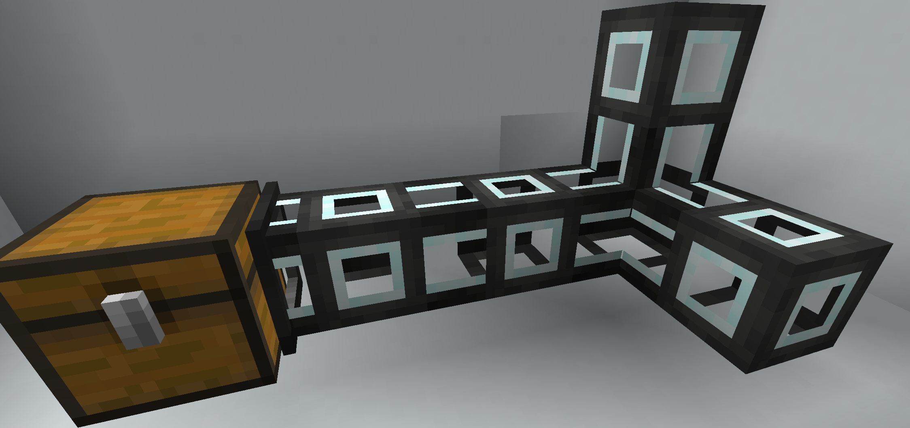

# BlockModel物品模型  

---

## JSON Model Structure  

方块的物品模型,与`json`模型相比更加之复杂,我们会阐释一下  

首先是`models/block/block.json`,定义了方块在不同`视角/TransformType`对应的变换参数

<details>
<summary>block.json</summary>

```json
{
    "gui_light": "side",
    "display": {
        "gui": {
            "rotation": [ 30, 225, 0 ],
            "translation": [ 0, 0, 0],
            "scale":[ 0.625, 0.625, 0.625 ]
        },
        "ground": {
            "rotation": [ 0, 0, 0 ],
            "translation": [ 0, 3, 0],
            "scale":[ 0.25, 0.25, 0.25 ]
        },
        "fixed": {
            "rotation": [ 0, 0, 0 ],
            "translation": [ 0, 0, 0],
            "scale":[ 0.5, 0.5, 0.5 ]
        },
        "thirdperson_righthand": {
            "rotation": [ 75, 45, 0 ],
            "translation": [ 0, 2.5, 0],
            "scale": [ 0.375, 0.375, 0.375 ]
        },
        "firstperson_righthand": {
            "rotation": [ 0, 45, 0 ],
            "translation": [ 0, 0, 0 ],
            "scale": [ 0.40, 0.40, 0.40 ]
        },
        "firstperson_lefthand": {
            "rotation": [ 0, 225, 0 ],
            "translation": [ 0, 0, 0 ],
            "scale": [ 0.40, 0.40, 0.40 ]
        }
    }
}

```

</details>

然后对于普通的六面方块来说,都来直接或间接来自`models/block/cube.json`  

```json
{
    "parent": "block/block",
    "elements": [
        {   "from": [ 0, 0, 0 ],
            "to": [ 16, 16, 16 ],
            "faces": {
                "down":  { "texture": "#down", "cullface": "down" },
                "up":    { "texture": "#up", "cullface": "up" },
                "north": { "texture": "#north", "cullface": "north" },
                "south": { "texture": "#south", "cullface": "south" },
                "west":  { "texture": "#west", "cullface": "west" },
                "east":  { "texture": "#east", "cullface": "east" }
            }
        }
    ]
}
```

这里比较特殊的是`texture`后面的`#down` `#up`等,将会查找自将继承此模型的模型,比如`models/block/cube_all.json`  

```json
{
    "parent": "block/cube",
    "textures": {
        "particle": "#all",
        "down": "#all",
        "up": "#all",
        "north": "#all",
        "east": "#all",
        "south": "#all",
        "west": "#all"
    }
}
```

其他非普通六面的模型,则定义其`elements`,如台阶  

<details>
<summary>stair.json</summary>

```json
{   "parent": "block/block",
    "display": {
        "gui": {
            "rotation": [ 30, 135, 0 ],
            "translation": [ 0, 0, 0],
            "scale":[ 0.625, 0.625, 0.625 ]
        },
        "head": {
            "rotation": [ 0, -90, 0 ],
            "translation": [ 0, 0, 0 ],
            "scale": [ 1, 1, 1 ]
        },
        "thirdperson_lefthand": {
            "rotation": [ 75, -135, 0 ],
            "translation": [ 0, 2.5, 0],
            "scale": [ 0.375, 0.375, 0.375 ]
        }
    },
    "textures": {
        "particle": "#side"
    },
    "elements": [
        {   "from": [ 0, 0, 0 ],
            "to": [ 16, 8, 16 ],
            "faces": {
                "down":  { "uv": [ 0, 0, 16, 16 ], "texture": "#bottom", "cullface": "down" },
                "up":    { "uv": [ 0, 0, 16, 16 ], "texture": "#top" },
                "north": { "uv": [ 0, 8, 16, 16 ], "texture": "#side", "cullface": "north" },
                "south": { "uv": [ 0, 8, 16, 16 ], "texture": "#side", "cullface": "south" },
                "west":  { "uv": [ 0, 8, 16, 16 ], "texture": "#side", "cullface": "west" },
                "east":  { "uv": [ 0, 8, 16, 16 ], "texture": "#side", "cullface": "east" }
            }
        },
        {   "from": [ 8, 8, 0 ],
            "to": [ 16, 16, 16 ],
            "faces": {
                "up":    { "uv": [ 8, 0, 16, 16 ], "texture": "#top", "cullface": "up" },
                "north": { "uv": [ 0, 0,  8,  8 ], "texture": "#side", "cullface": "north" },
                "south": { "uv": [ 8, 0, 16,  8 ], "texture": "#side", "cullface": "south" },
                "west":  { "uv": [ 0, 0, 16,  8 ], "texture": "#side" },
                "east":  { "uv": [ 0, 0, 16,  8 ], "texture": "#side", "cullface": "east" }
            }
        }
    ]
}

```

</details>

可以观察出,一个`element`,由`from`和`to`定义其在16个体素范围内的位置,由`face`定义其每个面的材质  

>[!note]
> 方块对应的物品默认是没有材质的  
> 请详见[ModelResourceLocation](render/itemModel.md#modelresourcelocation)和[Use Block Model](render/itemModel.md#use-block-model)

## BlockState

打开游戏,按下f3,可以看到右侧的`Targeted Block`和`Targeted Fluid`下,除了显示所指向的方块名称
在以`#`为标识的`Tag`之上,有的方块/流体还显示了一些别的信息,这就是`BlockState`  

在Minecraft内创建世界的时候,有一种隐藏的世界类型称之为`debug mode`,见[wiki](https://minecraft.fandom.com/wiki/Debug_mode)  
里面枚举所有方块/流体的BlockState  

想要为你的方块添加`BlockState`,你需要复写`protected void createBlockStateDefinition(StateDefinition.Builder<Block, BlockState> pBuilder)`  
原版已定义的在类`BlockStateProperties`内,可以直接引用  

若你想创建自己的BlockState,可以选择实现抽象类`net.minecraft.world.level.block.state.properties.Property>`  
当然,原版已经有特化实现`BooleanProperty`,`DirectionProperty`,`EnumProperty`,`IntegerProperty`  

>[!warning]
> 方块所持有的`BlockState`会在加载模型时候,穷举其所有排列组合,即笛卡尔积  
> 请确保其枚举总可能结果数量在一个合理的范围内  

## JSON model  

---

### Variants Model

原版拥有两种以`BlockState`描述模型的方式,在[wiki](https://minecraft.fandom.com/wiki/Model#Block_states)都有描述
其一便是`Variants Block Model`  
其思路为排列组合枚举所有的`BlockState`,并要求逐一给出对应的模型  
这里以草方块为例,其拥有一个布尔类型的名为snow的BlockState  

首先是`blockState`的文件,blockstates/grass_block.json  
```json
{
  "variants": {
    "snowy=false": [
      {
        "model": "minecraft:block/grass_block"
      },
      {
        "model": "minecraft:block/grass_block",
        "y": 90
      },
      {
        "model": "minecraft:block/grass_block",
        "y": 180
      },
      {
        "model": "minecraft:block/grass_block",
        "y": 270
      }
    ],
    "snowy=true": {
      "model": "minecraft:block/grass_block_snow"
    }
  }
}
```

然后是模型文件  

<!-- tabs:start -->
#### **block/grass_block.json**

```json
{   "parent": "block/block",
  "textures": {
    "particle": "block/dirt",
    "bottom": "block/dirt",
    "top": "block/grass_block_top",
    "side": "block/grass_block_side",
    "overlay": "block/grass_block_side_overlay"
  },
  "elements": [
    {   "from": [ 0, 0, 0 ],
      "to": [ 16, 16, 16 ],
      "faces": {
        "down":  { "uv": [ 0, 0, 16, 16 ], "texture": "#bottom", "cullface": "down" },
        "up":    { "uv": [ 0, 0, 16, 16 ], "texture": "#top",    "cullface": "up", "tintindex": 0 },
        "north": { "uv": [ 0, 0, 16, 16 ], "texture": "#side",   "cullface": "north" },
        "south": { "uv": [ 0, 0, 16, 16 ], "texture": "#side",   "cullface": "south" },
        "west":  { "uv": [ 0, 0, 16, 16 ], "texture": "#side",   "cullface": "west" },
        "east":  { "uv": [ 0, 0, 16, 16 ], "texture": "#side",   "cullface": "east" }
      }
    },
    {   "from": [ 0, 0, 0 ],
      "to": [ 16, 16, 16 ],
      "faces": {
        "north": { "uv": [ 0, 0, 16, 16 ], "texture": "#overlay", "tintindex": 0, "cullface": "north" },
        "south": { "uv": [ 0, 0, 16, 16 ], "texture": "#overlay", "tintindex": 0, "cullface": "south" },
        "west":  { "uv": [ 0, 0, 16, 16 ], "texture": "#overlay", "tintindex": 0, "cullface": "west" },
        "east":  { "uv": [ 0, 0, 16, 16 ], "texture": "#overlay", "tintindex": 0, "cullface": "east" }
      }
    }
  ]
}

```

#### **block/grass_block_snow**

```json
{
  "parent": "minecraft:block/cube_bottom_top",
  "textures": {
    "top": "minecraft:block/grass_block_top",
    "bottom": "minecraft:block/dirt",
    "side": "minecraft:block/grass_block_snow",
    "particle": "minecraft:block/dirt"
  }
}
```

#### **item/grass_block**
```json
{
  "parent": "minecraft:block/grass_block"
}
```
<!-- tabs:end -->


这里我们给出一个多阶段作物的[例子](https://github.com/MalayPrime/rotarism-decorations/blob/master/src/generated/resources/assets/blockstates/canola.json)


### Multipart Model

另一种则称之为`Multipart Model`,与`Variants`不同,这种方式可以视为模型在一系列条件下的叠加  
以原版的栅栏为例  

```json
{
  "multipart": [
    {
      "apply": {"model": "minecraft:block/acacia_fence_post"}
    },
    {
      "when": {"north": "true"},
      "apply": {"model": "minecraft:block/acacia_fence_side","uvlock": true}
    },
    {
      "when": {"east": "true"},
      "apply": {"model": "minecraft:block/acacia_fence_side","y": 90,"uvlock": true}
    },
    {
      "when": {"south": "true"},
      "apply": {"model": "minecraft:block/acacia_fence_side","y": 180,"uvlock": true}
    },
    {
      "when": {"west": "true"},
      "apply": {"model": "minecraft:block/acacia_fence_side","y": 270,"uvlock": true}
    }
  ]
}
```

其渲染流程可视为,对一系列`when`进行判断,如果成立,则`叠加/应用/apply`所指定的模型  
当然这这一系列操作并不会发生在渲染时,在模型加载阶段就已经完成  

在这里我们给出一个管道的[例子](https://github.com/MalayPrime/rotarism-decorations/blob/master/src/generated/resources/assets/blockstates/normal_pipe.json)

