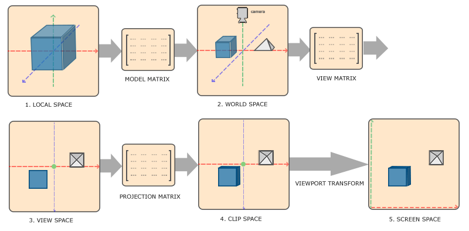

# CoordinateSystem

---

>[!note]
> 本章所阐述的坐标系统，指代在渲染时使用的坐标系统  
> 并非为用于实体方位的坐标系  

## Review

在介绍mc的渲染坐标系前，首先请了解`MVP`变换，你可以在这里找到它们的介绍

* [LearnOpenGL](https://learnopengl.com/Getting-started/Coordinate-Systems)
* [LearnOpenGLCN](https://learnopengl-cn.github.io/01%20Getting%20started/08%20Coordinate%20Systems/)  



1. `Local Space(本地/局部空间)`,可理解为建模时使用的坐标
2. `World Space(世界空间)`,在游戏内，一个模型可出现在多处，此时采用的坐标
3. `View Space(视口空间)`,摄像机所观察到的空间
4. `Clip Space(剪切空间)`,具有透视投影/正交投影性质的空间
5. `Normalized Device Coordinate(NDC Space)`,各分量除以w,所有坐标都处于-1到1内，左下为[-1，1],右上为[1,1]
6. `Screen Space`,`glViewPort`所定义的空间  

箭头上标注的矩阵即为将上一个空间变换到下一个空间的矩阵

>[!note]
> 前三个空间并非是OpenGL定义的  
> `Vertex Shader`的内置变量`gl_Position`输出的为`Clip Space`  
> `Fragment Shader`的内置变量`gl_FragCoord`较为复杂,首先来自`NDC空间`  
> xy分量受到[Fragment shader coordinate origin](https://www.khronos.org/opengl/wiki/Layout_Qualifier_(GLSL)#Fragment_shader_coordinate_origin)和glViewPort的影响  
> z分量受到`glDepthRange`影响  
> w分量为`Clip Space` w分量的倒数  

对于mc游戏内使用的坐标，我们在本文章中称之为方块坐标  

## In World

为了将坐标映射到`Clip Space`,mc仍采用上述流程，只不过模型矩阵与视图矩阵合并为同一个矩阵，后文称之为`MV矩阵`    
对于投影矩阵，mc采用的是`透视投影矩阵`，可以在`GameRender#getProjectionMatrix`找到具体代码  
且该矩阵始终不为单位矩阵  

设置中的bobView是通过投影矩阵实现的

### Render Chunk

>[!attention]
> 在批量渲染区块的过程中,MV矩阵不为单位矩阵  
> 渲染的坐标中心为摄像机坐标中心,即以摄像机坐标为原点  

以`rendertype_solid.vsh`为例,近保留坐标变换内容  

```glsl
in vec3 Position;
in vec3 Normal;

uniform sampler2D Sampler2;

uniform mat4 ModelViewMat;
uniform mat4 ProjMat;
uniform vec3 ChunkOffset;

void main() {
    vec3 pos = Position + ChunkOffset;
    gl_Position = ProjMat * ModelViewMat * vec4(pos, 1.0);

    vertexDistance = fog_distance(ModelViewMat, pos, FogShape);
    normal = ProjMat * ModelViewMat * vec4(Normal, 0.0);
}
```

`Postion`为BlockPosition & 0xFF,即坐标数据的后四位,即表示自身相对于自身chunk原点所在的位置  
`ChunkOffset`是批量渲染区块时一个特有的uniform变量,其值为`RenderChunkDispatcher$RenderChunk.origin - camPos`  
每个`RenderChunkDispatcher$RenderChunk`代表一个16x16x16范围  
根据上文所述的以摄像机中心为原点,在此我们可以通过简单的`pos + camPos`得到该顶点的方块坐标  
`Camera.getPosition()`可直接拿到摄像机的方块坐标  
此时的MV矩阵仅受到摄像机方向的影响  

对于流体渲染也是同理，因此没有任何modder会直接调用`LiquidBlockRenderer`来渲染流体  
因为原版使用的流体渲染会直接抹除坐标的部分信息,而在非chunk渲染种,被抹除的信息不会被正确补全/修正  

### Other

对于非区块渲染，`MV矩阵`始终为单位矩阵,无法提供任何的坐标信息,且不存在`ChunkOffset`的等价表示  
因此mc使用`PoseStack`,对提交的顶点在cpu内进行`逐顶点预乘`  

结合上文的描述,以摄像机为原点。因此我们常常能在`RenderLevelLastEvent/RenderLevelStageEvent`见到这种操作  
```java
var poseStack = new PoseStack(); //仅表示目前仍然是单位矩阵  
poseStack.translate(-cameraPos.x, -cameraPos.y, -cameraPos.z);  
poseStack.translate(blockPos.x,blockPos.y,blockPos.z);  
```

## GUI

在gui体系内,mc的渲染坐标系便较为统一,在此我们还会介绍`SDF`在此的使用并让其支持原版的`PoseStack`系统  

首先我们要介绍的是mc引入的一个叫做`GuiScale`的变量，可以通过`Minecraft.getInstance().window.guiScale`拿到  
同时在window内有三对字段储存了窗口的宽高

| Name                 | Meaning                          |
|----------------------|----------------------------------|
| width                | actual length, measured in pixel |
| height               | actual length, measured in pixel |
| framebufferWidth     | actual length, measured in pixel |
| framebufferHeight    | actual length, measured in pixel |
| guiScaledWidth       | length / guiScale                |
| guiScaledHeight      | length / guiScale                |
| getWidth()           | actual length                    |
| getHeight()          | actual length                    |
| getGuiScaledWidth()  | length / guiScale                |
| getGuiScaledHeight() | length / guiScale                |

对于gui内渲染，mc重新定义了一个空间，在本文，我们称之为`gui空间`  
该空间以左上角为原点，向右为x轴正方向，向下为y轴正方向，即左上角为(0,0),右下角为(guiScaledWidth,guiScaledHeight)  
同时，我们为了讲述方便，定义一个`未规范化屏幕空间`，左上角为(0,0),右下角为(actual width,actual height)  
并且定义`屏幕空间`为左下角(-1,-1),右上角(1,1),中心点为(0,0)  

在gui内，mc使用的投影矩阵为正交投影矩阵，定义空间与gui空间一致，且近平面为1000，远平面为3000  
在forge环境下，有提供`guiLayers`,每有一层的guiLayers，在3000的基础上增加2000

原版定义的所有部件，使用的所有空间都为gui空间，包括x,y,width,height  
在部件内拿到鼠标对于的坐标空间也是gui空间  
可以在GameRender#render内找到类似代码  

```java
var mouseX = (mouseHandler.xpos() * getWindow().getGuiScaledWidth() / getWindow().getScreenWidth());  
var mouseY = (mouseHandler.ypos() * getWindow().getGuiScaledHeight() / getWindow().getScreenHeight());  
```

如果想在gui中启用`scissor test(剪切测试)`，请通过`guiScale`进行修正，类似这样  
```java
RenderSystem.enableScissor(
                (int) (x * scale),
                (int) (minecraft.getWindow().getHeight() - (y + height) * scale),
                (int) (width * scale),
                (int) (height * scale));
```

## SDF

可以直接传输二维的屏幕坐标空间,给出如下screen.fsh  
可以通过修改是否定义宏`SUPPORT_POSE_STACK`来开关对其支持
```glsl
#version 150

#define SUPPORT_POSE_STACK

in vec3 Position;// base on normalized screen postion

out vec2 screenPos;// before modified by gui scale
out vec2 guiPos;// modified by gui scale
out vec2 uv;// normalized into [-1,1]

uniform float GuiScale;
uniform vec2 ScreenSize;

#ifdef SUPPORT_POSE_STACK
uniform mat4 PoseStack;
uniform mat4 ProjMat;
#endif

void main() {
    gl_Position = vec4(Position.xy, 0.0, 1.0);
    vec2 normalizedPos = gl_Position.xy * 0.5 + 0.5;
    screenPos = ScreenSize * vec2(normalizedPos.x, 1-normalizedPos.y);
    guiPos = screenPos / GuiScale;
    uv = gl_Position.xy;
    #ifdef SUPPORT_POSE_STACK
    gl_Position = vec4(((ProjMat) * PoseStack  * vec4(guiPos, 0.0, 1.0)).xy, 0.0, 1.0);
    #endif
}
```
仅需传输四个顶点坐标即可,类似于
```java
var builder = Tesselator.getInstance().getBuilder();

builder.begin(VertexFormat.Mode.QUADS, DefaultVertexFormat.POSITION);
builder.vertex(-1.0, 1.0, 0.0).endVertex();
builder.vertex(-1.0, -1.0, 0.0).endVertex();
builder.vertex(1.0, -1.0, 0.0).endVertex();
builder.vertex(1.0, 1.0, 0.0).endVertex();
builder.end();

BufferUploader._endInternal(builder);//for <119 
BufferUploader.draw(bufferbuilder.end()); for >= 119 //changed at 22w16a
```

## Utility

- [实用顶点处理函数](https://github.com/onnowhere/core_shaders/blob/master/.shader_utils/vsh_util.glsl)