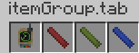

# ItemModel物品模型

---

## ModelResourceLocation  

在正式开始前,我们需要介绍一下`ModelResourceLocation`,继承自`ResourceLocation`,与之相比多了一个名为`variant`的字段  
与`ResourceLocation`一样,同样拥有`namespace`和`path`字段  
在这里,前者表示模型所处的`命名空间`,即`modID`,而后者则对应所属物品/方块的`registryName`  
而`variant`对于物品,则为`inventory`  
对于方块,则描述了其`BlockState`,若没有BlockState,则为空字符串  
`toString`方法为`<namespace>:<registryName>#<variant>`  

想要拿到`BlockState`对应的`ModelResourceLocation`可以通过`BlockModelShaper#stateToModelLocation`  
物品则可通过`ModelResourceLocation(<item>.registryName, "inventory")`  

## Normal Model

具体可以参见[wiki](https://minecraft.fandom.com/zh/wiki/%E6%A8%A1%E5%9E%8B#.E7.89.A9.E5.93.81.E6.A8.A1.E5.9E.8B)  

### Use Block Model

**_方块对应的物品默认是没有材质的_**  
如果你的物品想要使用方块的模型,例如`BlockItem`的物品模型  
可以直接让`parent`指向方块对应的模型,格式:`<nameSpace>:block/<blockRegisterName>`,`<>`内为根据实际填写的字段  

### Layer Model

mc自带的一种生成模型的方式,一多层的`Layer`叠加,为物品生成模型
可以查看`forge`对原版的扩展,在`ItemLayerModel`内,扩展了原版仅支持4个`layer`至无限  

### 3D Json Model

资源文件结构  

```treeview
resources/
`-- assets/
    `-- cobalt/
        |-- models/
        |   `-- item/
        |       |-- weather_indicator.json
        |       |-- weather_indicator_empty.json
        `-- textures/
            `-- weather_indicator/
                `-- weather_indicator.png
```

注册物品
```kotlin-s
private val ITEM = DeferredRegister.create(ForgeRegistries.ITEMS, Cobalt.MOD_ID)
private val whetherIndicator = ITEM.register("weather_indicator") { Item(Item.Properties().tab(creativeTab)) }
```

```java-s
private DeferredRegister<Item> ITEM = DeferredRegister.create(ForgeRegistries.ITEMS, Cobalt.MOD_ID);
private RegistryObject<Item> whetherIndicator = ITEM.register("weather_indicator", () -> new Item(Item.Properties().tab(creativeTab)));
```

上述文件结构中`weather_indicator.json`尚未编写,其他json模型,都由`blockBench`生成  
```json
{
  "parent": "cobalt:item/weather_indicator_empty"
}
```
这样子即可引用`json模型`,效果如下


## Item Property Override  

天气指示器,仅有一种样式肯定是不够的,为此,我们需要借助如下机制  
原版提供了一种名为`overrides`的机制,可以通过一定的上下文,从有限数目的模型中指定一个进行渲染  

调用`ItemProperties.register(Item pItem, ResourceLocation pName, ItemPropertyFunction pProperty)`  
第一个参数`pItem`即需要绑定的物品  
第二个参数`pName`指的是`overrides`的名称,原版的有[这些](https://minecraft.fandom.com/zh/wiki/%E6%A8%A1%E5%9E%8B#.E7.89.A9.E5.93.81.E6.A0.87.E7.AD.BE.E8.B0.93.E8.AF.8D)  
第三个参数就是给定上下文,返回模型的地方了  

```java
@Deprecated
@OnlyIn(Dist.CLIENT)
public interface ItemPropertyFunction {
   float call(ItemStack pStack, @Nullable ClientLevel pLevel, @Nullable LivingEntity pEntity, int pSeed);
}

@OnlyIn(Dist.CLIENT)
public interface ClampedItemPropertyFunction extends ItemPropertyFunction {
   /** @deprecated */
   @Deprecated
   default float call(ItemStack pStack, @Nullable ClientLevel pLevel, @Nullable LivingEntity pEntity, int pSeed) {
      return Mth.clamp(this.unclampedCall(pStack, pLevel, pEntity, pSeed), 0.0F, 1.0F);
   }

   float unclampedCall(ItemStack pStack, @Nullable ClientLevel pLevel, @Nullable LivingEntity pEntity, int pSeed);
}
```
我们应该使用下面那个函数式接口  

第三个参数pSeed,部分传入为`0`,部分为`ItemEntity的ID`  
理论上也可以自己随意使用  

代码
```kotlin-s
private val whetherIndicator = ITEM.register("weather_indicator"){
    object :Item(Properties().tab(creativeTab)){
        override fun isFoil(pStack: ItemStack): Boolean {
            return if (Thread.currentThread().threadGroup == SidedThreadGroups.SERVER||Minecraft.getInstance().level?.isThundering == true){
                true
            }else{
                super.isFoil(pStack)
            }
        }
    }
}

fun setItemOverride(event: FMLClientSetupEvent) {
    ItemProperties.register(whetherIndicator.get(), ResourceLocation(Cobalt.MOD_ID, "weather"))
    { itemStack: ItemStack, _: ClientLevel?, livingEntity: LivingEntity?, seed: Int ->
        val clientLevel = Minecraft.getInstance().level
        if (clientLevel == null) {
            0f
        } else {
            if (clientLevel.isRaining) {
                1f
            } else if (clientLevel.dayTime < 11000) {
                2f
            } else {
                3f
            }
        }
    }
}
```

```java-s
private Item whetherIndicator = ITEM.register("weather_indicator", () -> new Item(Properties().tab(creativeTab)) {
	@Override
	public bool isFoil(pStack: ItemStack) {
		var level = Minecraft.getInstance().level
		if (Thread.currentThread().threadGroup ==SidedThreadGroups.SERVER || (level != null && level.isThundering)) {
			return true;
		}else {
			super.isFoil(pStack);
		}
	}
});

public static void setItemOverride(FMLClientSetupEvent event) {
    ItemProperties.register(whetherIndicator.get(), ResourceLocation(Cobalt.MOD_ID, "weather"),
        (ItemStack itemStack, _, LivingEntity livingEntity, int seed) -> {
	        var clientLevel = Minecraft.getInstance().level;
	        if (clientLevel == null){
	            return 0f;
	        }else{
	            if (clientLevel.isRaining) {
	                return 1f;
	            } else if (clientLevel.dayTime < 11000) {
	                return 2f;
	            } else {
	                return 3f;
	            }	            
	        }
        } 
    );
} 
```

资源文件结构

```treeview
resources/
`-- assets/
    `-- cobalt/
        |-- models/
        |   `-- item/
        |       |-- weather_indicator.json
        |       |-- weather_indicator_cloud.json
        |       |-- weather_indicator_empty.json
        |       `-- weather_indicator_sun.json
        `-- textures/
            `-- weather_indicator/
                |-- cloud1.png
                |-- cloud2.png
                |-- moon1.png
                |-- moon2.png
                |-- sun1.png
                |-- sun2.png
                `-- weather_indicator.png
```

效果如下
  

逻辑如下
  

---

## colouring

这一小结,我们讲制作一支支持染色的粉笔  

### principle

`ItemRenderer`类内

```java
public void renderQuadList(PoseStack pMatrixStack, VertexConsumer pBuffer, List<BakedQuad> pQuads, ItemStack pItemStack, int pCombinedLight, int pCombinedOverlay) {
   boolean flag = !pItemStack.isEmpty();
   PoseStack.Pose posestack$pose = pMatrixStack.last();

   for(BakedQuad bakedquad : pQuads) {
      int i = -1;
      if (flag && bakedquad.isTinted()) {
         i = this.itemColors.getColor(pItemStack, bakedquad.getTintIndex()); //!
      }

      float f = (float)(i >> 16 & 255) / 255.0F;
      float f1 = (float)(i >> 8 & 255) / 255.0F;
      float f2 = (float)(i & 255) / 255.0F;
      pBuffer.putBulkData(posestack$pose, bakedquad, f, f1, f2, pCombinedLight, pCombinedOverlay, true);
   }
}
```

可以看到,`getColor`的返回值会被分割为三个参数,传递给`VertexConsumer#putBulkData`  
而这三个参数会直接乘以将要提交的顶点的颜色  

```java
default void putBulkData(PoseStack.Pose pose, BakedQuad bakedQuad, float[] baseBrightness, float red, float green, float blue, float alpha, int[] lightmap, int packedOverlay, boolean readExistingColor) {
    int[] aint = bakedQuad.getVertices();
    Vec3i faceNormal = bakedQuad.getDirection().getNormal();
    Vector3f normal = new Vector3f((float)faceNormal.getX(), (float)faceNormal.getY(), (float)faceNormal.getZ());
    Matrix4f matrix4f = pose.pose();
    normal.transform(pose.normal());
    int intSize = DefaultVertexFormat.BLOCK.getIntegerSize();
    int vertexCount = aint.length / intSize;

    try (MemoryStack memorystack = MemoryStack.stackPush()) {
        ByteBuffer bytebuffer = memorystack.malloc(DefaultVertexFormat.BLOCK.getVertexSize());
        IntBuffer intbuffer = bytebuffer.asIntBuffer();

        for(int v = 0; v < vertexCount; ++v) {
            ((Buffer)intbuffer).clear();
            intbuffer.put(aint, v * 8, 8);
            float f = bytebuffer.getFloat(0);
            float f1 = bytebuffer.getFloat(4);
            float f2 = bytebuffer.getFloat(8);
            float cr;
            float cg;
            float cb;
            float ca;
            if (readExistingColor) {
                float r = (float)(bytebuffer.get(12) & 255) / 255.0F;
                float g = (float)(bytebuffer.get(13) & 255) / 255.0F;
                float b = (float)(bytebuffer.get(14) & 255) / 255.0F;
                float a = (float)(bytebuffer.get(15) & 255) / 255.0F;
                cr = r * baseBrightness[v] * red;   //!
                cg = g * baseBrightness[v] * green; //!
                cb = b * baseBrightness[v] * blue;  //!
                ca = a * alpha;
            } else {
                cr = baseBrightness[v] * red;   //!
                cg = baseBrightness[v] * green; //!
                cb = baseBrightness[v] * blue;  //!
                ca = alpha;
            }

            int lightmapCoord = applyBakedLighting(lightmap[v], bytebuffer);
            float f9 = bytebuffer.getFloat(16);
            float f10 = bytebuffer.getFloat(20);
            Vector4f pos = new Vector4f(f, f1, f2, 1.0F);
            pos.transform(matrix4f);
            applyBakedNormals(normal, bytebuffer, pose.normal());
            ((VertexConsumer)this).vertex(pos.x(), pos.y(), pos.z(), cr, cg, cb, ca, f9, f10, packedOverlay, lightmapCoord, normal.x(), normal.y(), normal.z());
            //!
        }
    }
}
```

### finite

```java
@OnlyIn(Dist.CLIENT)
public interface ItemColor {
   int getColor(ItemStack pStack, int pTintIndex);
}
```
利用此接口,返回值为`rgb`,`pTintIndex`为`json`模型内参数  

注册通过`ItemColors.register(ItemColor pItemColor, ItemLike... pItems)`  

<!-- tabs:start -->
#### **item register**

```kotlin-s
val redChalk = ITEM.register("red_chalk") { Item(Item.Properties().tab(creativeTab)) }
val greenChalk = ITEM.register("green_chalk") { Item(Item.Properties().tab(creativeTab)) }
val blueChalk = ITEM.register("blue_chalk") { Item(Item.Properties().tab(creativeTab)) }
```

```java-s
RegistryObject<Item> redChalk = ITEM.register("red_chalk", () -> new Item(Item.Properties().tab(creativeTab)));
RegistryObject<Item> greenChalk = ITEM.register("green_chalk", () -> new Item(Item.Properties().tab(creativeTab)));
RegistryObject<Item> blueChalk = ITEM.register("blue_chalk", () -> new Item(Item.Properties().tab(creativeTab)));
```

#### **ItemColor register**

```kotlin-s
@JvmStatic
fun registerColorHandle(event: ColorHandlerEvent.Item) {
    event.itemColors.register({ pStack, pTintIndex ->
        when (pStack.item) {
            redChalk.get() -> MaterialColor.COLOR_RED
            greenChalk.get() -> MaterialColor.COLOR_GREEN
            blueChalk.get() -> MaterialColor.COLOR_BLUE
            else -> MaterialColor.COLOR_BLACK
        }.col
    }, redChalk.get(), greenChalk.get(), blueChalk.get())
}
```

```java-s
public static void registerColorHandle(ColorHandlerEvent.Item event) {
    event.itemColors.register({ pStack, pTintIndex ->
        return switch(pStack.item){
            case redChalk.get() -> MaterialColor.COLOR_RED;
            case greenChalk.get() -> MaterialColor.COLOR_GREEN;
            case blueChalk.get() -> MaterialColor.COLOR_BLUE;
            case else -> MaterialColor.COLOR_BLACK;
        }.col;
    }, redChalk.get(), greenChalk.get(), blueChalk.get());
}
```

<!-- tabs:end -->

就可以看到  


### infinite

有限颜色的粉笔肯定是不行的  
从代码原理我们可以看出,染色的原理几乎就是将提交的顶点数据的颜色部分,乘以我们返回的`RGB`值  
所以,我们可以不通过`TintIndex`,而通过`stackItem`的`nbt`数据获取信息  

<!-- tabs:start -->
#### **colorful chalk item**

```kotlin-s
class ColorfulChalk : Item(Properties().tab(creativeTab)) {
    fun setColor(itemStack: ItemStack, color: Int) {
        val nbt = IntTag.valueOf(color)
        itemStack.addTagElement("color", nbt)
    }

    fun getColor(itemStack: ItemStack): Int {
        val nbt = itemStack.tag?.get("color") as? IntTag
        return nbt?.asInt ?: 0xffffff
    }
}

val colorfulChalk = ITEM.register("colorful_chalk"){ColorfulChalk()}
```

```java-s
class ColorfulChalk extends Item {

	public ColorfulChalk() {
		super(new Properties().tab(creativeTab));
	}

    public void setColor(ItemStack itemStack, int color) {
        var nbt = IntTag.valueOf(color);
        itemStack.addTagElement("color", nbt);
    }

    public int getColor(ItemStack itemStack) {
        var tag = itemStack.tag;
        if(tag =! null && tag.get("color") instanceof IntTag colorTag) {
            return colorTag.asInt;
        }else {
            return 0xffffff;
        }
    }
}

RegistryObject<ColorfulChalk> colorfulChalk = ITEM.register("colorful_chalk", ColorfulChalk::new);
```

#### **ItemColor register**

```kotlin-s
@JvmStatic
fun registerColorHandle(event: ColorHandlerEvent.Item) {
    event.itemColors.register({pStack,_ ->
        (pStack.item as ColorfulChalk).getColor(pStack)
    }, colorfulChalk.get())
}
```

```java-s
public static void registerColorHandle(ColorHandlerEvent.Item event) {
    event.itemColors.register({pStack,_ ->
        ((ColorfulChalk)pStack.item).getColor(pStack)
    }, colorfulChalk.get());
}
```

### **Command**

```kotlin-s
@JvmStatic
fun registerCommand(event: RegisterCommandsEvent) {
    event.dispatcher.register(LiteralArgumentBuilder.literal<CommandSourceStack?>("setColor").then(
        Commands.argument("color",HexArgumentType(0,0xffffff))
            .executes { ctx ->
                val color = ctx.getArgument("color", Int::class.java)
                val source = ctx.source
                val entity = source.entity
                if (entity is Player) {
                    val itemStack = entity.mainHandItem
                    if (itemStack.item is ColorfulChalk) {
                        (itemStack.item as ColorfulChalk).setColor(itemStack, color)
                        source.sendSuccess(TextComponent("successfully set color"), true)
                    } else {
                        source.sendFailure(TextComponent("main hand isn't holding colorfulChalk"))
                    }
                }else{
                    source.sendFailure(TextComponent("sender is not a player"))
                }
                0
            }
    ))
}
```

```java-s
public static void registerCommand(RegisterCommandsEvent event) {
    event.dispatcher.register(LiteralArgumentBuilder.literal<CommandSourceStack?>("setColor").then(
        Commands.argument("color",new HexArgumentType(0,0xffffff))
            .executes { ctx ->
                var color = ctx.getArgument("color", Int::class.java);
                var source = ctx.source;
                var entity = source.entity;
                if (entity instanceof Player) {
                    var itemStack = entity.mainHandItem;
                    if (itemStack.item instanceof ColorfulChalk) {
                        (itemStack.item as ColorfulChalk).setColor(itemStack, color);
                        source.sendSuccess(TextComponent("successfully set color"), true);
                    } else {
                        source.sendFailure(TextComponent("main hand isn't holding colorfulChalk"));
                    }
                }else{
                    source.sendFailure(TextComponent("sender is not a player"));
                }
                return 0;
            }
    ));
}
```

### **HexArgumentType**

```kotlin-s
class HexArgumentType(private val minimum: Int = Int.MIN_VALUE, private val maximum: Int = Int.MAX_VALUE) :
    ArgumentType<Int> {

    companion object {
        private val example = mutableListOf("0xffffff", "0xff00ff")
        private val hexSynaxErrorType = DynamicCommandExceptionType { value ->
            LiteralMessage("hex number must begin witch 0x instead of $value")
        }
        private val readerExpectedStartOf0x = SimpleCommandExceptionType(LiteralMessage("expected start with 0x"))
        private val noHexInputType = SimpleCommandExceptionType(LiteralMessage("please enter number"))
    }

    @Throws(CommandSyntaxException::class)
    override fun parse(reader: StringReader): Int {
        var cursor = reader.cursor
        try {
            val first = reader.read()
            val second = reader.read()
            if (first != '0' || second != 'x') {
                reader.cursor = cursor
                throw hexSynaxErrorType.createWithContext(reader, "$first$second")
            }
        } catch (e: Exception) {
            throw readerExpectedStartOf0x.create()
        }
        cursor += 2
        val result :String
        try {
            result = reader.readString()
        }catch (e:Exception){
            throw noHexInputType.create()
        }
        val resultNum = Integer.parseInt(result,16)
        if (resultNum < minimum) {
            reader.cursor = cursor
            throw CommandSyntaxException.BUILT_IN_EXCEPTIONS.integerTooLow().createWithContext(reader, result, minimum)
        }
        if (resultNum > maximum) {
            reader.cursor = cursor
            throw CommandSyntaxException.BUILT_IN_EXCEPTIONS.integerTooHigh().createWithContext(reader, result, maximum)
        }
        return resultNum
    }

    override fun equals(other: Any?): Boolean {
        if (this === other) return true
        if (other !is IntegerArgumentType) return false
        val that = other
        return maximum == that.maximum && minimum == that.minimum
    }

    override fun hashCode(): Int {
        return 31 * minimum + maximum
    }

    override fun toString(): String {
        return if (minimum == Int.MIN_VALUE && maximum == Int.MAX_VALUE) {
            "integer()"
        } else if (maximum == Int.MAX_VALUE) {
            "integer($minimum)"
        } else {
            "integer($minimum, $maximum)"
        }
    }

    override fun getExamples(): MutableCollection<String> = example

}
```

```java-s
class HexArgumentType extends ArgumentType<Integer> {
    private int minimum = Integer.MAX_VALUE;
    private int maximum = Integer.MAX_VALUE;
    
    private static List<Integer> example = mutableListOf("0xffffff", "0xff00ff");
    private static DynamicCommandExceptionType hexSynaxErrorType = DynamicCommandExceptionType ( value ->
        LiteralMessage("hex number must begin witch 0x instead of " + value)
    );
    private SimpleCommandExceptionType readerExpectedStartOf0x = SimpleCommandExceptionType(LiteralMessage("expected start with 0x"))
    private SimpleCommandExceptionType noHexInputType = SimpleCommandExceptionType(LiteralMessage("please enter number"))

	@Override
    public int parse(reader: StringReader) throws CommandSyntaxException {
        var cursor = reader.cursor;
        try {
            var first = reader.read();
            var second = reader.read();
            if (first != '0' || second != 'x') {
                reader.cursor = cursor;
                throw new hexSynaxErrorType.createWithContext(reader, first + "" +second);
            }
        } catch (Exception e) {
            throw readerExpectedStartOf0x.create();
        }
        cursor += 2;
        var result :String;
        try {
            result = reader.readString();
        }catch (e:Exception){
            throw noHexInputType.create();
        }
        var resultNum = Integer.parseInt(result,16);
        if (resultNum < minimum) {
            reader.cursor = cursor;
            throw CommandSyntaxException.BUILT_IN_EXCEPTIONS.integerTooLow().createWithContext(reader, result, minimum);
        }
        if (resultNum > maximum) {
            reader.cursor = cursor;
            throw CommandSyntaxException.BUILT_IN_EXCEPTIONS.integerTooHigh().createWithContext(reader, result, maximum);
        }
        return resultNum;
    }

	@Override
    public bool equals(Object other) {
        if (this == other) return true;
        if (!(other instanceof IntegerArgumentType)) return false;
        return maximum == other.maximum && minimum == other.minimum;
    }
    
	@Override 
	public int hashCode() {
        return 31 * minimum + maximum;
    }

    @Override
    public String toString() {
        if (minimum == Int.MIN_VALUE && maximum == Int.MAX_VALUE) {
            return "integer()";
        } else if (maximum == Int.MAX_VALUE) {
            return "integer(" + "minimum + ")";
        } else {
            return "integer(" + "minimum" + ", " +maximum + ")";
        }
    }

	@Override
    public MutableCollection<String> getExamples() {
        return example;
    }

}
```

<!-- tabs:end -->

再编写一个命令,用于给粉笔设置颜色  
就可以得到这样的效果  


## Overrides

本节的`Overrides`与上文的`Item Property Overrides`不同,指的是`ItemOverrides`类  
而上文的`Item Property Overrides`只是`ItemOverrides`的默认实现  

`ItemOverrides`中有这样一个方法  
`public BakedModel resolve(BakedModel pModel, ItemStack pStack, @Nullable ClientLevel pLevel, @Nullable LivingEntity pEntity, int pSeed)`  
通过这个方法,我们就能在不同的时候返回不同的`BkaedModel`,不在限制在预先定义的范围内  

这里给出两种办法,一种通过`ModelBakedEvent`直接替换并利用代理模式,包上一层  

```kotlin-s
fun setBakedModel(event: ModelBakeEvent){
    val modelResourceLocation = ModelResourceLocation(AllRegisters.drawableChalk.get().registryName,"inventory")
    val model = event.modelRegistry[modelResourceLocation]
    event.modelRegistry[modelResourceLocation] = object : BakedModelWrapper<BakedModel>(model) {
        override fun getOverrides(): ItemOverrides = OverrideItemOverrides()
    }
}
```

```java-s
public void setBakedModel(ModelBakeEvent event){
    var modelResourceLocation = new ModelResourceLocation(AllRegisters.drawableChalk.get().registryName,"inventory");
    var model = event.modelRegistry.get(modelResourceLocation);
    event.modelRegistry.set(modelResourceLocation) = new BakedModelWrapper<BakedModel>(model) {
        @Override public ItemOverrides getOverrides() { return OverrideItemOverrides();)
    };
}
```


如果你不嫌麻烦的话,可以这样  

<!-- tabs:start -->
#### **OverrideModelLoader**

```kotlin-s
class OverrideModelLoader : IModelLoader<OverrideModelGeometry> {
    companion object {
        @JvmStatic
        fun registerModelLoader(event: ModelRegistryEvent) {
            ModelLoaderRegistry.registerLoader(
                ResourceLocation(Cobalt.MOD_ID, "override_loader"),
                OverrideModelLoader()
            )
        }
    }

    override fun onResourceManagerReload(pResourceManager: ResourceManager) {

    }

    override fun read(
        deserializationContext: JsonDeserializationContext,
        modelContents: JsonObject
    ): OverrideModelGeometry {
        modelContents.remove("loader")
        val model = deserializationContext.deserialize<BlockModel>(modelContents, BlockModel::class.java)
        return OverrideModelGeometry(model)
    }

}
```

```java-s
class OverrideModelLoader extends IModelLoader<OverrideModelGeometry> {

    public static void registerModelLoader(ModelRegistryEvent event) {
        ModelLoaderRegistry.registerLoader(
            ResourceLocation(Cobalt.MOD_ID, "override_loader"),
            new OverrideModelLoader()
        );
    }

    @Override
    public void onResourceManagerReload(ResourceManager pResourceManager) {}

    @Override
    public OverrideModelGeometry read(JsonDeserializationContext deserializationContext, JsonObject modelContents) {
        modelContents.remove("loader");
        var model = deserializationContext.deserialize<BlockModel>(modelContents, BlockModel::class.java);
        return OverrideModelGeometry(model);
    }

}
```

#### **OverrideModelGeometry**

```kotlin-s
class OverrideModelGeometry(val delegate: BlockModel) : IModelGeometry<OverrideModelGeometry> {
    override fun bake(
        owner: IModelConfiguration?,
        bakery: ModelBakery?,
        spriteGetter: Function<Material, TextureAtlasSprite>?,
        modelTransform: ModelState?,
        overrides: ItemOverrides?,
        modelLocation: ResourceLocation?
    ): BakedModel {

        val delegateModel = delegate.bake(
            bakery, delegate, spriteGetter, modelTransform, modelLocation, delegate.guiLight.lightLikeBlock()
        )
        return OverrideWrappedBakedModel(delegateModel, OverrideItemOverrides())
    }

    override fun getTextures(
        owner: IModelConfiguration?,
        modelGetter: Function<ResourceLocation, UnbakedModel>?,
        missingTextureErrors: MutableSet<Pair<String, String>>?
    ): MutableCollection<Material> {
        return delegate.getMaterials(modelGetter, missingTextureErrors)
    }

}
```

```java-s
class OverrideModelGeometry extends IModelGeometry<OverrideModelGeometry> {
	
	delegate: BlockModel;
	
	OverrideModelGeometry(BlockModel delegate) {
		this.delegate = delegate;
	}

    @Override
    public BakedModel bake(IModelConfiguration owner,ModelBakery bakery,Function<Material, TextureAtlasSprite> spriteGetter,
        ModelState modelTransform,ItemOverrides overrides,ResourceLocation modelLocation) {
        var delegateModel = delegate.bake(
            bakery, delegate, spriteGetter, modelTransform, modelLocation, delegate.guiLight.lightLikeBlock()
        );
        return OverrideWrappedBakedModel(delegateModel, OverrideItemOverrides());
    }

    @Override
    public MutableCollection<Material> getTextures(IModelConfiguration owner,Function<ResourceLocation, UnbakedModel> modelGetter,
			MutableSet<Pair<String, String>> missingTextureErrors){
        return delegate.getMaterials(modelGetter, missingTextureErrors);
    }

}
```

#### **OverrideWrappedBakedModel**

```kotlin-s
class OverrideWrappedBakedModel(originalModel: BakedModel, private val overrides: OverrideItemOverrides) :
    BakedModelWrapper<BakedModel>(originalModel) {
    override fun getOverrides(): ItemOverrides = overrides
}
```

```java-s
class OverrideWrappedBakedModel extends BakedModelWrapper<BakedModel> {
    
    private OverrideItemOverrides overrides;
    
    public OverrideWrappedBakedModel(originalModel BakedModel, OverrideItemOverrides overrides){
        this.overrides = overrides;
        super(originModel);
    }
    
    @override
    public ItemOverrides getOverrides() { return overrides;}
}
```

#### **OverrideItemOverrides**

```kotlin-s
class OverrideItemOverrides : ItemOverrides() {

    companion object {
        val cache = mutableListOf<BakedModel>()
    }

    override fun resolve(
        pModel: BakedModel,
        pStack: ItemStack,
        pLevel: ClientLevel?,
        pEntity: LivingEntity?,
        pSeed: Int
    ): BakedModel? {
        val item = pStack.item as DrawableChalk
        val blockState = item.getBlockState(pStack)
        return if (blockState!=null){
            val modelManager = Minecraft.getInstance().modelManager
            val location = BlockModelShaper.stateToModelLocation(blockState)
            val model = modelManager.getModel(location)
            val quads = model.getQuads(null, null, Random(), EmptyModelData.INSTANCE)
            model
        }else{
            pModel
        }
    }
}
```

```java-s
class OverrideItemOverrides extends ItemOverrides() {

	static List<BakedModel> cache = mutableListOf<>();

    @Override
    public BakedModel resolve(BakedModel pModel,ItemStack pStack,ClientLevel pLevel,LivingEntity pEntity,Int pSeed) {
        var item = (DrawableChalk) pStack.item; 
        var blockState = item.getBlockState(pStack);
        if (blockState!=null){
            val modelManager = Minecraft.getInstance().modelManager;
            val location = BlockModelShaper.stateToModelLocation(blockState);
            val model = modelManager.getModel(location);
            val quads = model.getQuads(null, null, Random(), EmptyModelData.INSTANCE);
            return model;
        }else{
            return pModel;
        }
    }
}
```

#### **drawable_chalk.json**

```json
{
	"loader": "cobalt:override_loader",
	"parent": "item/generated",
	"textures": {
		"layer0": "cobalt:chalk"
	}
}
```

<!-- tabs:end -->

效果如下  


>[!note]
> 如果你像修正草方块的颜色
> 应该查询原版的实现方式,位置在`BlockColors`内类
> 其实现调用了`BiomeColors#getAverageGrassColor`

## BlockEntityWithoutLevelRenderer 

如果你需要更加动态的渲染物品或者物品的渲染需要和使用了`BlockEntityRender`的方块渲染效果一致    
那么你需要的是名为`BlockEntityWithoutLevelRenderer`,曾叫做`ItemStackTileEntityRenderer`  
以代码的方式进行渲染,做到你想要的一切  

首先要让MC知道你的物品模型需要`BlockEntityWithoutLevelRenderer`,这需要你的`BakedModel.isCustomRenderer`返回`true`  

因为在`ItemRender#render`内,会以此作为判断

而要实现这一目标,给出两种办法  

一种是让你的`json`模型,直接或间接继承自`builtin/entity`,原因如下  

在`ModelBakery#loadBlockModel`中,如果你的物品模型,继承自`builtin/entity`  
你的模型就会被读取为一个名为`BLOCK_ENTITY_MARKER`的`BlockModel/UnbakedModel`  
在`BlockModel#bakeVanilla`,模型就会被`bake`为`BuiltInModel`,它的`isCustomRender()`返回就为`true`  

另一种就是在`ModelBakeEvent`中进行替换,同上文替换`overrides`一致  

当然你也可以和上文一样,直接定义一个`IModelLoader`走一个模型加载的全套流程  

这样,只要给你的物品复写`public void initializeClient(Consumer<IItemRenderProperties> consumer)`  
给传入的`consumer`传入一个复写了`BlockEntityWithoutLevelRenderer getItemStackRenderer()`的`IItemRenderProperties`即可  
不然则会默认返回`BlockEntityWithoutLevelRenderer(blockEntityRenderDispatcher,/*EntityModelSet*/ entityModels)`  

通过以上操作,物品在渲染时候就会调用你传入的`BlockEntityWithoutLevelRender#renderByItem`  

示例如下

```kotlin-s
override fun initializeClient(consumer: Consumer<IItemRenderProperties>) {
    consumer.accept(object : IItemRenderProperties {
        override fun getItemStackRenderer(): BlockEntityWithoutLevelRenderer {
            return object : BlockEntityWithoutLevelRenderer(
                Minecraft.getInstance().blockEntityRenderDispatcher, Minecraft.getInstance().entityModels
            ) {
                override fun renderByItem(
                    pStack: ItemStack,
                    pTransformType: TransformType,
                    pPoseStack: PoseStack,
                    pBuffer: MultiBufferSource,
                    pPackedLight: Int,
                    pPackedOverlay: Int
                ) {
                    //do anything you want to do
                }
            }
        }
    })
}
```

```java-s
@Override
public void initializeClient(consumer: Consumer<IItemRenderProperties>) {
    consumer.accept(new IItemRenderProperties {
        @Override
        public BlockEntityWithoutLevelRenderer getItemStackRenderer() {
            return new BlockEntityWithoutLevelRenderer(
                Minecraft.getInstance().blockEntityRenderDispatcher, Minecraft.getInstance().entityModels
            ) {
                @Override
                public void renderByItem(ItemStack pStack,TransformType pTransformType,PoseStack pPoseStack,
                    MultiBufferSource pBuffer,Int pPackedLight,Int pPackedOverlay
                ) {
                    //do anything you want to do
                }
            }
        }
    })
}
```