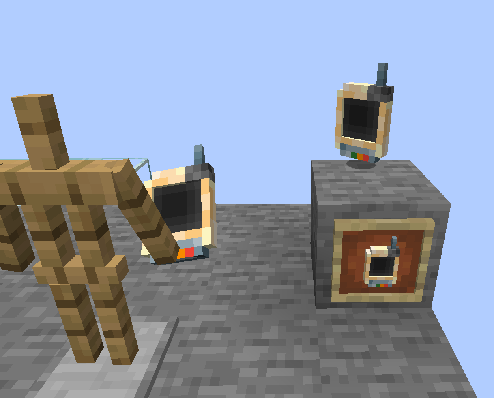
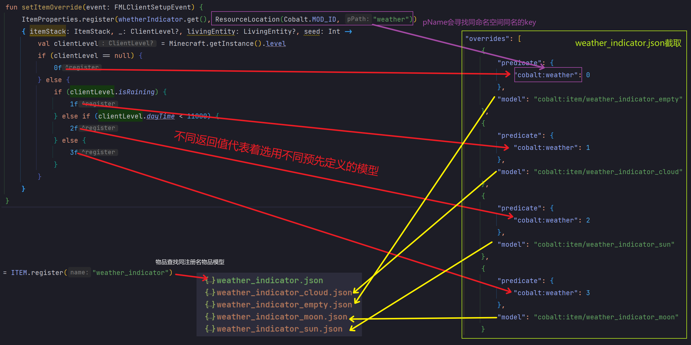
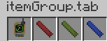

# ItemModel物品模型

---

## Normal Model

具体可以参见[wiki](https://minecraft.fandom.com/zh/wiki/%E6%A8%A1%E5%9E%8B#.E7.89.A9.E5.93.81.E6.A8.A1.E5.9E.8B)

### Layer Model


### 3D Json Model

资源文件结构  

```treeview
resources/
`-- assets/
    `-- cobalt/
        |-- models/
        |   `-- item/
        |       |-- weather_indicator.json
        |       |-- weather_indicator_empty.json
        `-- textures/
            `-- weather_indicator/
                `-- weather_indicator.png
```

注册物品
```kotlin
private val ITEM = DeferredRegister.create(ForgeRegistries.ITEMS, Cobalt.MOD_ID)
private val whetherIndicator = ITEM.register("weather_indicator") { Item(Item.Properties().tab(creativeTab)) }
```

上述文件结构中`weather_indicator.json`尚未编写,其他json模型,都由`blockbench`生成  
```json
{
  "parent": "cobalt:item/weather_indicator_empty"
}
```
这样子即可引用`json模型`,效果如下



## Item overrides

天气指示器,仅有一种样式肯定是不够的,为此,我们需要借助如下机制  
原版提供了一种名为`overrides`的机制,可以通过一定的上下文,从有限数目的模型中指定一个进行渲染  

调用`ItemProperties.register(Item pItem, ResourceLocation pName, ItemPropertyFunction pProperty)`  
第一个参数`pItem`即需要绑定的物品  
第二个参数`pName`指的是`overrides`的名称,原版的有[这些](https://minecraft.fandom.com/zh/wiki/%E6%A8%A1%E5%9E%8B#.E7.89.A9.E5.93.81.E6.A0.87.E7.AD.BE.E8.B0.93.E8.AF.8D)  
第三个参数就是给定上下文,返回模型的地方了

```java
@Deprecated
@OnlyIn(Dist.CLIENT)
public interface ItemPropertyFunction {
   float call(ItemStack pStack, @Nullable ClientLevel pLevel, @Nullable LivingEntity pEntity, int pSeed);
}

@OnlyIn(Dist.CLIENT)
public interface ClampedItemPropertyFunction extends ItemPropertyFunction {
   /** @deprecated */
   @Deprecated
   default float call(ItemStack pStack, @Nullable ClientLevel pLevel, @Nullable LivingEntity pEntity, int pSeed) {
      return Mth.clamp(this.unclampedCall(pStack, pLevel, pEntity, pSeed), 0.0F, 1.0F);
   }

   float unclampedCall(ItemStack pStack, @Nullable ClientLevel pLevel, @Nullable LivingEntity pEntity, int pSeed);
}
```
我们应该使用下面那个函数式接口  

第三个参数pSeed,部分传入为`0`,部分为`ItemEntity的ID`  
理论上也可以自己随意使用  

代码
```kotlin
private val whetherIndicator = ITEM.register("weather_indicator"){
    object :Item(Properties().tab(creativeTab)){
        override fun isFoil(pStack: ItemStack): Boolean {
            return if (Thread.currentThread().threadGroup == SidedThreadGroups.SERVER||Minecraft.getInstance().level?.isThundering == true){
                true
            }else{
                super.isFoil(pStack)
            }
        }
    }
}

fun setItemOverride(event: FMLClientSetupEvent) {
    ItemProperties.register(whetherIndicator.get(), ResourceLocation(Cobalt.MOD_ID, "weather"))
    { itemStack: ItemStack, _: ClientLevel?, livingEntity: LivingEntity?, seed: Int ->
        val clientLevel = Minecraft.getInstance().level
        if (clientLevel == null) {
            0f
        } else {
            if (clientLevel.isRaining) {
                1f
            } else if (clientLevel.dayTime < 11000) {
                2f
            } else {
                3f
            }
        }
    }
}
```

资源文件结构

```treeview
resources/
`-- assets/
    `-- cobalt/
        |-- models/
        |   `-- item/
        |       |-- weather_indicator.json
        |       |-- weather_indicator_cloud.json
        |       |-- weather_indicator_empty.json
        |       `-- weather_indicator_sun.json
        `-- textures/
            `-- weather_indicator/
                |-- cloud1.png
                |-- cloud2.png
                |-- moon1.png
                |-- moon2.png
                |-- sun1.png
                |-- sun2.png
                `-- weather_indicator.png
```

效果如下
  

逻辑如下
  

---

## colouring

这一小结,我们讲制作一支支持染色的粉笔  

### principle

`ItemRenderer`类内

```java
public void renderQuadList(PoseStack pMatrixStack, VertexConsumer pBuffer, List<BakedQuad> pQuads, ItemStack pItemStack, int pCombinedLight, int pCombinedOverlay) {
   boolean flag = !pItemStack.isEmpty();
   PoseStack.Pose posestack$pose = pMatrixStack.last();

   for(BakedQuad bakedquad : pQuads) {
      int i = -1;
      if (flag && bakedquad.isTinted()) {
         i = this.itemColors.getColor(pItemStack, bakedquad.getTintIndex()); //!
      }

      float f = (float)(i >> 16 & 255) / 255.0F;
      float f1 = (float)(i >> 8 & 255) / 255.0F;
      float f2 = (float)(i & 255) / 255.0F;
      pBuffer.putBulkData(posestack$pose, bakedquad, f, f1, f2, pCombinedLight, pCombinedOverlay, true);
   }
}
```

可以看到,`getColor`的返回值会被分割为三个参数,传递给`VertexConsumer#putBulkData`  
而这三个参数会直接乘以将要提交的顶点的颜色  

```java
default void putBulkData(PoseStack.Pose pose, BakedQuad bakedQuad, float[] baseBrightness, float red, float green, float blue, float alpha, int[] lightmap, int packedOverlay, boolean readExistingColor) {
    int[] aint = bakedQuad.getVertices();
    Vec3i faceNormal = bakedQuad.getDirection().getNormal();
    Vector3f normal = new Vector3f((float)faceNormal.getX(), (float)faceNormal.getY(), (float)faceNormal.getZ());
    Matrix4f matrix4f = pose.pose();
    normal.transform(pose.normal());
    int intSize = DefaultVertexFormat.BLOCK.getIntegerSize();
    int vertexCount = aint.length / intSize;

    try (MemoryStack memorystack = MemoryStack.stackPush()) {
        ByteBuffer bytebuffer = memorystack.malloc(DefaultVertexFormat.BLOCK.getVertexSize());
        IntBuffer intbuffer = bytebuffer.asIntBuffer();

        for(int v = 0; v < vertexCount; ++v) {
            ((Buffer)intbuffer).clear();
            intbuffer.put(aint, v * 8, 8);
            float f = bytebuffer.getFloat(0);
            float f1 = bytebuffer.getFloat(4);
            float f2 = bytebuffer.getFloat(8);
            float cr;
            float cg;
            float cb;
            float ca;
            if (readExistingColor) {
                float r = (float)(bytebuffer.get(12) & 255) / 255.0F;
                float g = (float)(bytebuffer.get(13) & 255) / 255.0F;
                float b = (float)(bytebuffer.get(14) & 255) / 255.0F;
                float a = (float)(bytebuffer.get(15) & 255) / 255.0F;
                cr = r * baseBrightness[v] * red;   //!
                cg = g * baseBrightness[v] * green; //!
                cb = b * baseBrightness[v] * blue;  //!
                ca = a * alpha;
            } else {
                cr = baseBrightness[v] * red;   //!
                cg = baseBrightness[v] * green; //!
                cb = baseBrightness[v] * blue;  //!
                ca = alpha;
            }

            int lightmapCoord = applyBakedLighting(lightmap[v], bytebuffer);
            float f9 = bytebuffer.getFloat(16);
            float f10 = bytebuffer.getFloat(20);
            Vector4f pos = new Vector4f(f, f1, f2, 1.0F);
            pos.transform(matrix4f);
            applyBakedNormals(normal, bytebuffer, pose.normal());
            ((VertexConsumer)this).vertex(pos.x(), pos.y(), pos.z(), cr, cg, cb, ca, f9, f10, packedOverlay, lightmapCoord, normal.x(), normal.y(), normal.z());
            //!
        }
    }
}
```

### finite

```java
@OnlyIn(Dist.CLIENT)
public interface ItemColor {
   int getColor(ItemStack pStack, int pTintIndex);
}
```
利用此接口,返回值为`rgb`,`pTintIndex`为`json`模型内参数  

注册通过`ItemColors.register(ItemColor pItemColor, ItemLike... pItems)`  

<!-- tabs:start -->
#### **物品注册**

```kotlin
val redChalk = ITEM.register("red_chalk") { Item(Item.Properties().tab(creativeTab)) }
val greenChalk = ITEM.register("green_chalk") { Item(Item.Properties().tab(creativeTab)) }
val blueChalk = ITEM.register("blue_chalk") { Item(Item.Properties().tab(creativeTab)) }
```

#### **ItemColor register**

```kotlin
@JvmStatic
fun registerColorHandle(event: ColorHandlerEvent.Item) {
    event.itemColors.register({ pStack, pTintIndex ->
        when (pStack.item) {
            redChalk.get() -> MaterialColor.COLOR_RED
            greenChalk.get() -> MaterialColor.COLOR_GREEN
            blueChalk.get() -> MaterialColor.COLOR_BLUE
            else -> MaterialColor.COLOR_BLACK
        }.col
    }, redChalk.get(), greenChalk.get(), blueChalk.get())
}
```

<!-- tabs:end -->

就可以看到  


### infinite

<!-- tabs:start -->
#### **colorful chalk item**

```kotlin
class ColorfulChalk : Item(Properties().tab(creativeTab)) {
    fun setColor(itemStack: ItemStack, color: Int) {
        val nbt = IntTag.valueOf(color)
        itemStack.addTagElement("color", nbt)
    }

    fun getColor(itemStack: ItemStack): Int {
        val nbt = itemStack.tag?.get("color") as? IntTag
        return nbt?.asInt ?: 0xffffff
    }
}

val colorfulChalk = ITEM.register("colorful_chalk"){ColorfulChalk()}
```

#### **ItemColor register**

```kotlin
@JvmStatic
fun registerColorHandle(event: ColorHandlerEvent.Item) {
    event.itemColors.register({pStack,_ ->
        (pStack.item as ColorfulChalk).getColor(pStack)
    }, colorfulChalk.get())
}
```

### **Command**

```kotlin
@JvmStatic
fun registerCommand(event: RegisterCommandsEvent) {
    event.dispatcher.register(LiteralArgumentBuilder.literal<CommandSourceStack?>("setColor").then(
        Commands.argument("color",HexArgumentType(0,0xffffff))
            .executes { ctx ->
                val color = ctx.getArgument("color", Int::class.java)
                val source = ctx.source
                val entity = source.entity
                if (entity is Player) {
                    val itemStack = entity.mainHandItem
                    if (itemStack.item is ColorfulChalk) {
                        (itemStack.item as ColorfulChalk).setColor(itemStack, color)
                        source.sendSuccess(TextComponent("successfully set color"), true)
                    } else {
                        source.sendFailure(TextComponent("main hand isn't holding colorfulChalk"))
                    }
                }else{
                    source.sendFailure(TextComponent("sender is not a player"))
                }
                0
            }
    ))
}
```

### **HexArgumentType**

```kotlin
class HexArgumentType(private val minimum: Int = Int.MIN_VALUE, private val maximum: Int = Int.MAX_VALUE) :
    ArgumentType<Int> {

    companion object {
        private val example = mutableListOf("0xffffff", "0xff00ff")
        private val hexSynaxErrorType = DynamicCommandExceptionType { value ->
            LiteralMessage("hex number must begin witch 0x instead of $value")
        }
        private val readerExpectedStartOf0x = SimpleCommandExceptionType(LiteralMessage("expected start with 0x"))
        private val noHexInputType = SimpleCommandExceptionType(LiteralMessage("please enter number"))
    }

    @Throws(CommandSyntaxException::class)
    override fun parse(reader: StringReader): Int {
        var cursor = reader.cursor
        try {
            val first = reader.read()
            val second = reader.read()
            if (first != '0' || second != 'x') {
                reader.cursor = cursor
                throw hexSynaxErrorType.createWithContext(reader, "$first$second")
            }
        } catch (e: Exception) {
            throw readerExpectedStartOf0x.create()
        }
        cursor += 2
        val result :String
        try {
            result = reader.readString()
        }catch (e:Exception){
            throw noHexInputType.create()
        }
        val resultNum = Integer.parseInt(result,16)
        if (resultNum < minimum) {
            reader.cursor = cursor
            throw CommandSyntaxException.BUILT_IN_EXCEPTIONS.integerTooLow().createWithContext(reader, result, minimum)
        }
        if (resultNum > maximum) {
            reader.cursor = cursor
            throw CommandSyntaxException.BUILT_IN_EXCEPTIONS.integerTooHigh().createWithContext(reader, result, maximum)
        }
        return resultNum
    }

    override fun equals(other: Any?): Boolean {
        if (this === other) return true
        if (other !is IntegerArgumentType) return false
        val that = other
        return maximum == that.maximum && minimum == that.minimum
    }

    override fun hashCode(): Int {
        return 31 * minimum + maximum
    }

    override fun toString(): String {
        return if (minimum == Int.MIN_VALUE && maximum == Int.MAX_VALUE) {
            "integer()"
        } else if (maximum == Int.MAX_VALUE) {
            "integer($minimum)"
        } else {
            "integer($minimum, $maximum)"
        }
    }

    override fun getExamples(): MutableCollection<String> = example

}
```

<!-- tabs:end -->

就可以得到这样的效果
