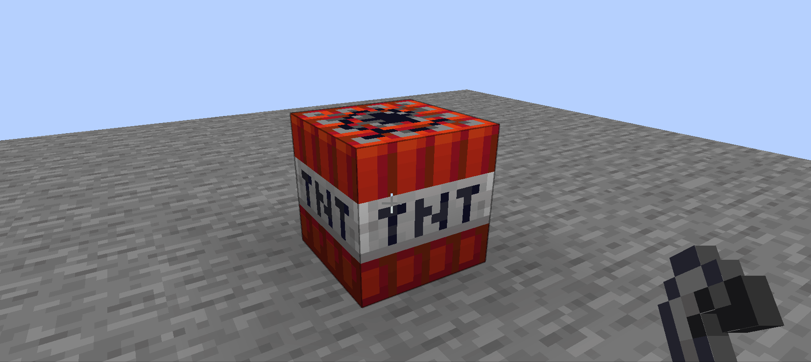

# overlyTexture

---

  

## source  

这张称之为OverlayTexture的材质不存在于材质包中,由代码生成  
如下为具体代码,来自`net.minecraft.client.renderer.texture.OverlayTexture`的构造方法
```java
for(int i = 0; i < 16; ++i) {
 for(int j = 0; j < 16; ++j) {
    if (i < 8) {
       nativeimage.setPixelRGBA(j, i, -1308622593);
    } else {
       int k = (int)((1.0F - (float)j / 15.0F * 0.75F) * 255.0F);
       nativeimage.setPixelRGBA(/*pX:*/ j , /*pY:*/ i , pAbgrColor:k << 24 | 16777215);
    }
 }
}
```
下半部分  
有符号数`-1308622593`转化为无符号数`2986344703`  
如果你想自己转化的话,可以随便找门语言
```cpp
std::cout << (unsigned int) (int) (-1308622593);
```
```kotlin
println((-1308622593).toUInt())
```
再次转化为16进制`b20000ff`  
从高位至地位(从左到右)代表alpha blue green red,对应rgba `ff 00 00 00 b2`  
上半部分  
有符号数`16777215`转化为16进制`ffffff`  
`k`左移24位,为二进制数8位,代表alpha,对应颜色rgba `ff ff ff k`

## principle & usage

---
这个材质有什么用呢,在说明这之前,我们先来回一下我们在函数参数中见到有关OverlayTexture的地方

```java
@OnlyIn(Dist.CLIENT)
public interface BlockEntityRenderer<T extends BlockEntity> {
   void render(T pBlockEntity, float pPartialTick, PoseStack pPoseStack,
        MultiBufferSource pBufferSource, int pPackedLight, int pPackedOverlay);

    ......
}
```
可以看到那个名为pPackedOverlay,或者在mcp mapping被称之为combinedOverlayIn的参数  
如果你查看它的Call Hierarchy,也就是调用结构,可以发现,传入的参数几乎都是一个名为  
`OverlayTexture.NO_OVERLAY`的东西,查找其定义是`OverlayTexture.pack(/*pU:*/0,/*pV:*/10)`  
而`pack`函数的定义又是
```java
public static int pack(int pU, int pV) {
  return pU | pV << 16;
}
```
可以发现,这个函数就是将v左移16位,把两个使用时一定范围较小的变量,合并到一个范围较大的变量中

在`com.mojang.blaze3d.vertex.VertexConsumer`中能发现  
```java
default VertexConsumer overlayCoords(int pOverlayUV) {
  return this.overlayCoords(pOverlayUV & '\uffff', pOverlayUV >> 16 & '\uffff');
}
```
这里的字符`'\uffff'`应该是反编译错误?,查看其字节码
```
  // access flags 0x1
  public default overlayCoords(I)Lcom/mojang/blaze3d/vertex/VertexConsumer;
   L0
    LINENUMBER 59 L0
    ALOAD 0
    ILOAD 1
    LDC 65535
    IAND
    ILOAD 1
    BIPUSH 16
    ISHR
    LDC 65535
    IAND
    INVOKEINTERFACE com/mojang/blaze3d/vertex/VertexConsumer.overlayCoords (II)Lcom/mojang/blaze3d/vertex/VertexConsumer; (itf)
    ARETURN
   L1
    LOCALVARIABLE this Lcom/mojang/blaze3d/vertex/VertexConsumer; L0 L1 0
    LOCALVARIABLE pOverlayUV I L0 L1 1
    MAXSTACK = 4
    MAXLOCALS = 2
```
可以发现是`65536`,即`0xff`  
该函数的处理参数与`OverlayTexture#pack`作用相反  

---

查看函数`overlayCoords`调用的方法会追踪到抽象函数`VertexConsumer uv2(int pU, int pV)`
查看其所有实现,除了`SheetedDecalTextureGenerator`的方法将参数用于设置`lightCoords`
其他实现都直接或间接的将参数没有经过处理,直接put进了`nio`的`ByteBuffer`  
没有任何地方对这个参数进行`normalize/标准化/归一化`,那么这个参数是如何使用的呢

虽然在`VertexFormatElement`的静态内部枚举`Usage`和`DefaultVertexFormat`类内我们都找不到相关信息  
但是在mc的`core shader` `rendertype_entity_solid.vsh`内
```glsl
#version 150

#moj_import <light.glsl>
#moj_import <fog.glsl>

in vec3 Position;
in vec4 Color;
in vec2 UV0;
in ivec2 UV1;
in ivec2 UV2;
in vec3 Normal;

uniform sampler2D Sampler1;
uniform sampler2D Sampler2;

uniform mat4 ModelViewMat;
uniform mat4 ProjMat;
uniform mat3 IViewRotMat;
uniform int FogShape;

uniform vec3 Light0_Direction;
uniform vec3 Light1_Direction;

out float vertexDistance;
out vec4 vertexColor;
out vec4 lightMapColor;
out vec4 overlayColor;
out vec2 texCoord0;
out vec4 normal;

void main() {
    gl_Position = ProjMat * ModelViewMat * vec4(Position, 1.0);

    vertexDistance = fog_distance(ModelViewMat, IViewRotMat * Position, FogShape);
    vertexColor = minecraft_mix_light(Light0_Direction, Light1_Direction, Normal, Color);
    lightMapColor = texelFetch(Sampler2, UV2 / 16, 0);
    overlayColor = texelFetch(Sampler1, UV1, 0);
    texCoord0 = UV0;
    normal = ProjMat * ModelViewMat * vec4(Normal, 0.0);
}
```
可以看到,overlayColor来自于Sampler1的UV1处  
而函数`texelFetch`的采样坐标正是不需要归一化的  
因此传入的参数即为对应材质的`UV坐标`  

`texelFetch`函数可以参考[docs.gl](https://docs.gl/sl4/texelFetch)和
[stackOverFlow上的一处回答](https://stackoverflow.com/a/45613787/15315647)

题外话
`#moj_import`是由类`GlslPreprocessor`处理的  
`UVO`可以发现是`材质坐标`  
`UV2`可以发现是`lightMap坐标`  

再次查看与之同名不同类型的片段着色器`rendertype_entity_solid.fsh`
```glsl
#version 150

#moj_import <fog.glsl>

uniform sampler2D Sampler0;

uniform vec4 ColorModulator;
uniform float FogStart;
uniform float FogEnd;
uniform vec4 FogColor;

in float vertexDistance;
in vec4 vertexColor;
in vec4 lightMapColor;
in vec4 overlayColor;
in vec2 texCoord0;
in vec4 normal;

out vec4 fragColor;

void main() {
    vec4 color = texture(Sampler0, texCoord0) * vertexColor * ColorModulator;
    color.rgb = mix(overlayColor.rgb, color.rgb, overlayColor.a);
    color *= lightMapColor;
    fragColor = linear_fog(color, vertexDistance, FogStart, FogEnd, FogColor);
}
```
这句`color.rgb = mix(overlayColor.rgb, color.rgb, overlayColor.a);`  
可以发现最终输出的color的rgb分量为自身rgb分量分别乘以overlayColor的rgb分量  
并且与其己归一化的(1-alpha)分量和alpha为加权系数求合  
[mix](https://docs.gl/sl4/mix)函数的说明可以在这里看到  

---

这时回过头来看类`OverlayTexture`的这两个函数
```java
public static int pack(float pU, boolean pHurt) {
  return pack(u(pU), v(pHurt));
}

public static int v(boolean pHurt) {
  return pHurt ? 3 : 10;
}
```
受伤对应的v坐标正是对应OverlayTexture下方的红色,即我们在游戏中看到的  
生物受伤时的红色效果  

等等,我记得生物受伤时的效果是会闪烁的吧?  
没错
查看类`LivingEntityRenderer`的`render`函数,有这样两行
```java
int i = getOverlayCoords(pEntity, this.getWhiteOverlayProgress(pEntity, pPartialTicks));
this.model.renderToBuffer(pMatrixStack, vertexconsumer, pPackedLight, i, 1.0F, 1.0F, 1.0F, flag1 ? 0.15F : 1.0F);
```
而`getOverlayCoords`函数为
```java
public static int getOverlayCoords(LivingEntity pLivingEntity, float pU) {
  return OverlayTexture.pack(OverlayTexture.u(pU), OverlayTexture.v(pLivingEntity.hurtTime > 0 || pLivingEntity.deathTime > 0));
}
```
又有`OverlayTexture#u`
```java
public static int u(float pU) {
  return (int)(pU * 15.0F);
}
```
`OverlayTexture`的U坐标正对应alpha的插值权重,而`pPartialTicks`又为处于0~1的插值参量  
因此动画便是线性变化的  
错!  
然而仅有白色的部分alpha是变化的,所以生物受伤/死亡时,表面红色程度固定  
那么TNT实体在点然后表面闪烁的白色?  
错!  
`TntMinecartRenderer`类内
```java
public static void renderWhiteSolidBlock(BlockState pBlockState, PoseStack pMatrixStack, MultiBufferSource pRenderTypeBuffer, int pCombinedLight, boolean pDoFullBright) {
  int i;
  if (pDoFullBright) {
     i = OverlayTexture.pack(OverlayTexture.u(1.0F), 10);
  } else {
     i = OverlayTexture.NO_OVERLAY;
  }

  Minecraft.getInstance().getBlockRenderer().renderSingleBlock(pBlockState, pMatrixStack, pRenderTypeBuffer, pCombinedLight, i);
}
```
```java
  int i = pEntity.getFuse();
  if ((float)i - pPartialTicks + 1.0F < 10.0F) {
     float f = 1.0F - ((float)i - pPartialTicks + 1.0F) / 10.0F;
     f = Mth.clamp(f, 0.0F, 1.0F);
     f *= f;
     f *= f;
     float f1 = 1.0F + f * 0.3F;
     pMatrixStack.scale(f1, f1, f1);
  }
  pdoFullBolckLight=i / 5 % 2 == 0;
```
还是固定程度的的....  

至少看完以后你知道了怎样实现这样一个效果

## example

比如


不太恰当的示例代码
```java
/**
 * make fired tnt twinkle
 */
@Mixin(TntMinecartRenderer.class)
abstract class MixinTNTMinecartRenderer {
    @ModifyVariable(
            method = "renderWhiteSolidBlock",
            at = @At(
                    value = "LOAD",
                    opcode = Opcodes.ILOAD
            ),
            ordinal = 1
    )
    private static int interpolatedOverlay(int value) {
        return OverlayTexture.pack(OverlayTexture.u(getU()), 10);
    }

    private static float getU() {
        var time = (float) (System.currentTimeMillis() % 1000 / 1000.0);
        if (time>0.5){
            return 1-time;
        }else {
            return time;
        }
    }
    
}
```