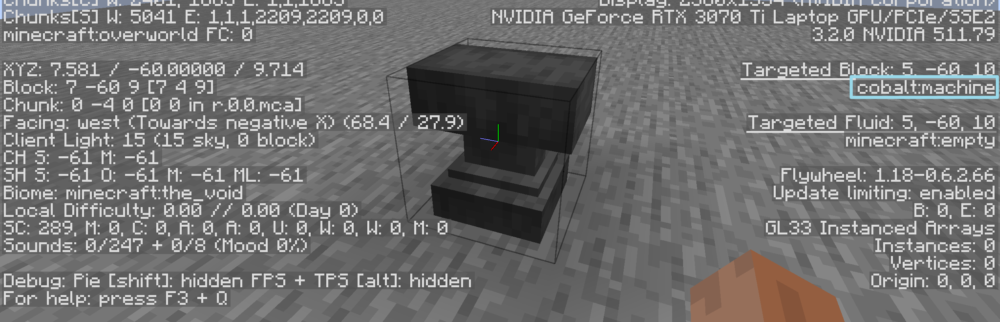
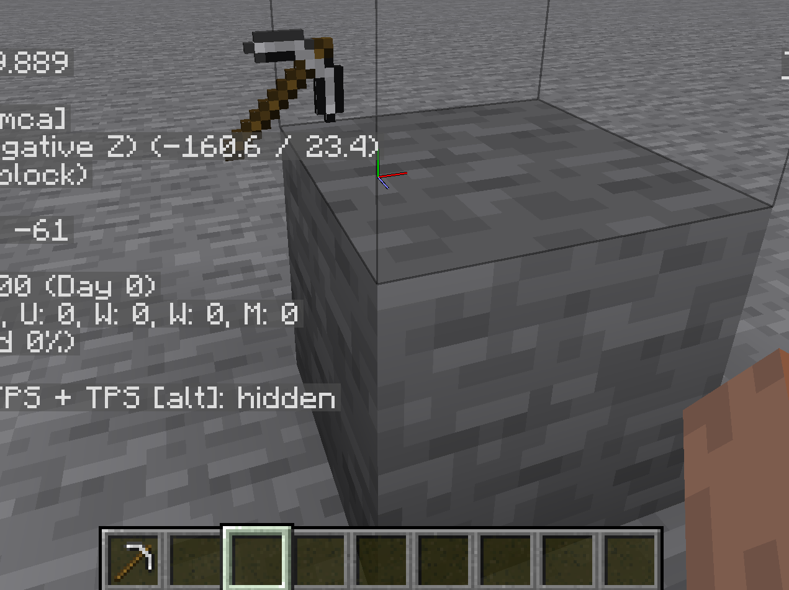
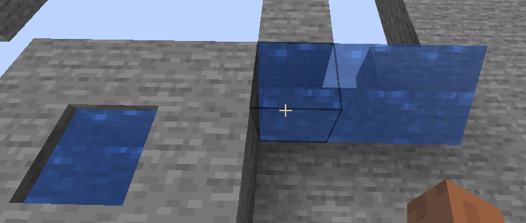

# renderInLevel

---

>[!note]
> 如果你绘制出的对象一直黑漆漆的,且使用了`pPackedLight`  
> 请检查其是否一直为0  
> 可以通过给方块添加`noOcclusion`或者非完整`VoxelShape`解决  


## Block

```kotlin
val blockRenderer = Minecraft.getInstance().blockRenderer
val blockstate = Blocks.ANVIL.defaultBlockState()
blockRenderer.renderSingleBlock(blockstate,pPoseStack, pBufferSource, pPackedLight
    , pPackedOverlay,EmptyModelData.INSTANCE)
```



不进行交互的话,只有f3能看出这其实不是个铁砧  

### BakedModel

```kotlin
val blockRenderer = Minecraft.getInstance().blockRenderer
val blockstate = Blocks.ANVIL.defaultBlockState()
val model = blockRenderer.getBlockModel(blockstate)
blockRenderer.modelRenderer.renderModel(pPoseStack.last(),
    pBufferSource.getBuffer(RenderType.solid()),
    blockstate, model,
    /*r*/1.0f,/*g*/1.0f,/*b*/1.0f,
    pPackedLight, pPackedOverlay,
    EmptyModelData.INSTANCE
)
```

`renderType`可从`ItemBlockRenderTypes#getRenderType`获取  
`r,g,b`参量仅在`BakedQuad`为`isTinted`时候被利用  

### BlockRenderDispatcher#renderBatched & ModelRender#tesselateBlock  

均用于原版用于绘制世界上的方块,其中有光照获取,并且内部有是否计算`AO(Ambient Occlusion/环境光遮蔽)`的分支

## Fluid  

从`Minecraft.getInstance().blockRenderer.getBlockModel(Blocks.WATER.defaultBlockState())`  
拿到的模型为空模型,原版没有类似于上文`renderSingleFluid`的方法,仅有  
`BlockRnederDispatcher#renderLiquid`,用于绘制世界上的流体,需要`Level`和`BlockPos`用于判断面是否需要渲染  
如果想自己绘制,可以参考其内部调用`LiquidBlockRender#tesselate`  
或者查看下文

## Item  

```kotlin
val itemRenderer = Minecraft.getInstance().itemRenderer
val itemStack = ItemStack(Items.IRON_PICKAXE) // need cache
val model =itemRenderer.getModel(itemStack,pBlockEntity.level,null,0)
itemRenderer.render(
    itemStack,ItemTransforms.TransformType.GROUND,/*left hand*/false,pPoseStack,
    pBufferSource,pPackedLight,pPackedOverlay,model
)
```

  

凭借此图,我们也得以一窥在`BlockEntityRender`内的`PoseStack`的位置和朝向如何

## Custom

给出一个利用`RenderType`自行提交顶点绘制流体的例子  

```kotlin
val renderType = RenderType.translucent()
val buffer = pBufferSource.getBuffer(renderType)
val pos = pBlockEntity.blockPos
val atlas = Minecraft.getInstance().getTextureAtlas(TextureAtlas.LOCATION_BLOCKS).apply(Fluids.WATER.attributes.stillTexture)
val color = Fluids.WATER.attributes.color
val r = color shr 16 and 255
val g = color shr 8 and 255
val b = color and 255
val alpha = color shr 24 and 255
val matrix = pPoseStack.last().pose()
buffer.vertex(matrix,0f,0f,0f)
    .color(r,g,b,alpha)
    .uv(atlas.u0,atlas.v0)
    .overlayCoords(OverlayTexture.NO_OVERLAY)
    .uv2(pPackedLight).normal(0.0F, 1.0F, 0.0F).endVertex()

buffer.vertex(matrix,0f,1f,1f)
    .color(r,g,b,alpha)
    .uv(atlas.u0,atlas.v1)
    .overlayCoords(OverlayTexture.NO_OVERLAY)
    .uv2(pPackedLight).normal(0.0F, 1.0F, 0.0F).endVertex()

buffer.vertex(matrix,1f,1f,1f)
    .color(r,g,b,alpha)
    .uv(atlas.u1,atlas.v1)
    .overlayCoords(OverlayTexture.NO_OVERLAY)
    .uv2(pPackedLight).normal(0.0F, 1.0F, 0.0F).endVertex()

buffer.vertex(matrix,1f,0f,0f)
    .color(r,g,b,alpha)
    .uv(atlas.u1,atlas.v0)
    .overlayCoords(OverlayTexture.NO_OVERLAY)
    .uv2(pPackedLight).normal(0.0F, 1.0F, 0.0F).endVertex()
```

  

>[!note]
> 如果流体贴图没用正确渲染  
> 查看背面是否渲染?如果是改变顶点提交的顺序  
> 是否是画质是否是`Fabulous(极佳)`,如果是,可以将renderType切换到  
> `Sheets.translucentCullBlockSheet()`

# Model 

`net.minecraft.client.model.Model`内,直接调用`renderToBuffer`即可