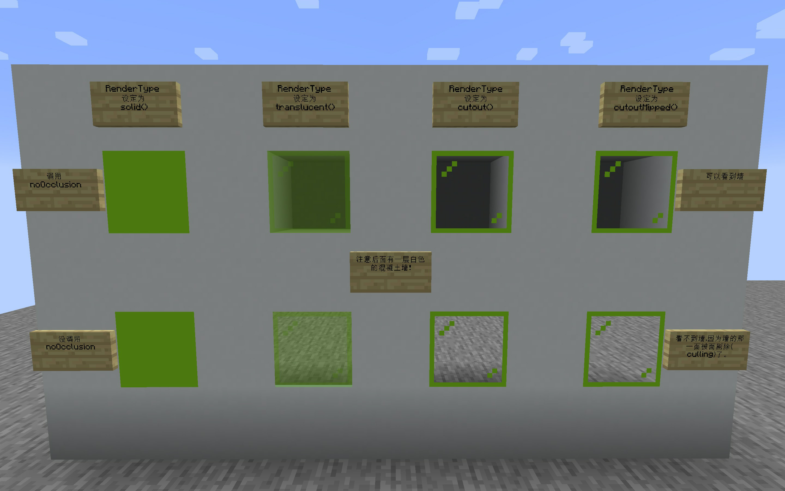

# RenderType

---

`RenderType`可以说是mc渲染中最为重要的一部分,而它实际上是一些列对于`OpenGL context`操作的合集

## structure

```mmd
flowchart RL
BooleanStateShard
CompositeRenderType
CullStateShard
DepthTestStateShard
EmptyTextureStateShard
LayeringStateShard
LightmapStateShard
LineStateShard
MultiTextureStateShard
OffsetTexturingStateShard
OutputStateShard
OverlayStateShard
RenderType
ShaderStateShard
TextureStateShard
TexturingStateShard
TransparencyStateShard
WriteMaskStateShard
RenderStateShard

BooleanStateShard  -->  RenderStateShard 
CompositeRenderType  -->  RenderType 
CullStateShard  -->  BooleanStateShard 
DepthTestStateShard  -->  RenderStateShard 
EmptyTextureStateShard  -->  RenderStateShard 
LayeringStateShard  -->  RenderStateShard 
LightmapStateShard  -->  BooleanStateShard 
LineStateShard  -->  RenderStateShard 
MultiTextureStateShard  -->  EmptyTextureStateShard 
OffsetTexturingStateShard  -->  TexturingStateShard 
OutputStateShard  -->  RenderStateShard 
OverlayStateShard  -->  BooleanStateShard 
RenderType  -->  RenderStateShard 
ShaderStateShard  -->  RenderStateShard 
TextureStateShard  -->  EmptyTextureStateShard 
TexturingStateShard  -->  RenderStateShard 
TransparencyStateShard  -->  RenderStateShard 
WriteMaskStateShard  -->  RenderStateShard 
```

处于继承树顶层的`RenderStateShard`拥有三个字段,`String name`,`Runnable setupState`,`Runnable clearState`  
正如起名,`setupState`,`clearState`分别在`renderType`配合调用`drawCall`前后被调用,用于便利的控制`opengl context`  
其他的派生类只是对所需改变上下文所需字段的特化

## overview table

| class/instance name        | name                     | extra/comment                                                                                     |
|----------------------------|--------------------------|---------------------------------------------------------------------------------------------------|
| **DepthTestStateShard**    | **depth_test**           | **String functionName**                                                                           |
| NO_DEPTH_TEST              |                          | functionName:always                                                                               |
| EQUAL_DEPTH_TEST           |                          | functionName:==                                                                                   |
| LEQUAL_DEPTH_TEST          |                          | functionName:<=                                                                                   |
| **LineStateShard**         | **line_width**           | **OptionalDouble width**                                                                          |
| DEFAULT_LINE               |                          | width:1.0                                                                                         |
| **ShaderStateShard**       | **shader**               | **Optional<Supplier<ShaderInstance>> shader**                                                     |
| **TransparencyStateShard** |                          |                                                                                                   |
| NO_TRANSPARENCY            | no_transparency          |                                                                                                   |
| ADDITIVE_TRANSPARENCY      | additive_transparency    | blendFunc(SRC.ONE,DEST.ONE)                                                                       |
| LIGHTNING_TRANSPARENCY     | lightning_transparency   | blendFunc(SRC.SRC_ALPHA,DEST.ONE)                                                                 |
| GLINT_TRANSPARENCY         | glint_transparency       | blendFuncSeparate<br/>SRC.SRC_COLOR,DEST.ONE<br/>SRC.ZERO,DEST.ONE                                |
| CRUMBLING_TRANSPARENCY     | crumbling_transparency   | blendFuncSeparate<br/>DEST.DST_COLOR,DEST.PME<br/>SRC.ONE,DEST.ZERO                               |
| TRANSLUCENT_TRANSPARENCY   | translucent_transparency | blendFuncSeparate<br/>SRC.SRC_ALPHA,DEST.ONE_MINUS_SRC_ALPHA<br/>SRC.ONE,DEST.ONE_MINUS_SRC_ALPHA |
| **WriteMaskStateShard**    | **write_mask_state**     | **boolean writeColor<br>boolean writeDepth**                                                      |
| COLOR_DEPTH_WRITE          |                          | writeColor:true<br/>writeDepth:true                                                               |
| COLOR_WRITE                |                          | writeColor:true<br/>writeDepth:false                                                              |
| DEPTH_WRITE                |                          | writeColor:false<br/>writeDepth:true                                                              |
| **OutputStateShard**       |                          |                                                                                                   |
| MAIN_TARGET                | main_target              | getMainRenderTarget()                                                                             |
| OUTLINE_TARGET             | outline_target           | levelRenderer.entityTarget()                                                                      |
| TRANSLUCENT_TARGET         | translucent_target       | levelRenderer.getTranslucentTarget()                                                              |
| PARTICLES_TARGET           | particles_target         | levelRenderer.getParticlesTarget()                                                                |
| WEATHER_TARGET             | weather_target           | levelRenderer.getWeatherTarget()                                                                  |
| CLOUDS_TARGET              | clouds_target            | levelRenderer.getCloudsTarget()                                                                   |
| ITEM_ENTITY_TARGET         | item_entity_target       | levelRenderer.getItemEntityTarget()                                                               |
| **LayeringStateShard**     |                          |                                                                                                   |
| NO_LAYERING                | no_layering              |                                                                                                   |
| POLYGON_OFFSET_LAYERING    | polygon_offset_layering  | polygonOffset(factor:-1.0F,units:-10.0F)                                                          |
| VIEW_OFFSET_Z_LAYERING     | view_offset_z_layering   | scale(x:0.99975586F,y:0.99975586F,z:0.99975586F)                                                  |
| **EmptyTextureStateShard** | **texture**              | **Optional<ResourceLocation> cutoutTexture()**                                                    |
| NO_TEXTURE                 |                          |                                                                                                   |
| **MultiTextureStateShard** |                          |                                                                                                   |
| **TextureStateShard**      |                          | **Optional<ResourceLocation> texture<br/>boolean blur<br/>boolean mipmap**                        |
| BLOCK_SHEET_MIPPED         |                          | texture:TextureAtlas.LOCATION_BLOCKS<br/>blur:false<br/>mipmap:true                               |
| BLOCK_SHEET                |                          | texture:TextureAtlas.LOCATION_BLOCKS<br/>blur:false<br/>mipmap:false                              |
| **TexturingStateShard**    |                          |                                                                                                   |
| DEFAULT_TEXTURING          | default_texturing        |                                                                                                   |
| GLINT_TEXTURING            | glint_texturing          | setupGlintTexturing(8.0F);                                                                        |
| ENTITY_GLINT_TEXTURING     | entity_glint_texturing   | setupGlintTexturing(0.16F);                                                                       |
| OffsetTexturingStateShard  | offset_texturing         |                                                                                                   |
| **BooleanStateShard**      |                          | **bool enabled**                                                                                  |
| **CullStateShard**         | **cull**                 | **bool useCull**                                                                                  |
| CULL                       |                          | useCull:true                                                                                      |
| NO_CULL                    |                          | useCull:false                                                                                     |
| **LightmapStateShard**     | **lightmap**             | **bool useLightMap**                                                                              |
| LIGHTMAP                   |                          | useLightMap:true                                                                                  |
| NO_LIGHTMAP                |                          | useLightMap:false                                                                                 |
| **OverlayStateShard**      | **overlay**              | **bool useLightmap**                                                                              |
| OVERLAY                    | overlay                  | useLightmap:true                                                                                  |
| NO_OVERLAY                 | overlay                  | useLightmap:false                                                                                 |

`CompositeState`正是每种`RenderStateShard`合集,mj还提供了`CompositeStateBuilder`用`Builder模式`来构造对象  
而`RenderType`则是`VertexFormat`,`bufferSize`,`CompositeState`的合集  

## example

利用`RenderType`简化上次的代码

```kotlin
@Suppress("unused")
@Mod.EventBusSubscriber(Dist.CLIENT)
object VertexFillByRenderType {

    private class RenderTypeHolder : RenderType("any", DefaultVertexFormat.POSITION_COLOR, VertexFormat.Mode.QUADS, 256, false, false, {}, {}) {
        companion object {
            @Suppress("INACCESSIBLE_TYPE")
            val renderType: RenderType = create(
                "posColorRenderType", DefaultVertexFormat.POSITION_COLOR, VertexFormat.Mode.QUADS, 256, false, false,
                CompositeState.builder()
                    .setShaderState(POSITION_COLOR_SHADER)
                    .setCullState(NO_CULL)
                    .setDepthTestState(NO_DEPTH_TEST)
                    .setTransparencyState(TRANSLUCENT_TRANSPARENCY)
                    .createCompositeState(false)
            )
        }
    }

    @SubscribeEvent
    @JvmStatic
    fun renderLevelLastEvent(event: RenderLevelLastEvent) {
        if (Minecraft.getInstance().player!!.mainHandItem.item != Items.ANVIL) {
            return
        }
        val bufferSource = Minecraft.getInstance().renderBuffers().bufferSource()
        val buffer = bufferSource.getBuffer(RenderTypeHolder.renderType)
        dataFill(event,buffer,Blocks.ANVIL)
        RenderSystem.disableDepthTest()
        bufferSource.endBatch(RenderTypeHolder.renderType)
    }
}
```

>[!note]
> 这里我们使用一个`RenderTypeHolder`  
> 是因为许多需要使用的字段访问级别仅为`protected`  
> 通过继承父类来暴露`protected`  
> 所以`holder`并不会被构造  

可以看到调用处,还是简洁了不少  
请无视最后的`RenderSystem.disableDepthTest()`,为什么有这个我折叠了,正常是不需要的

<details>
<summary>为什么呢</summary>

```java
public static class DepthTestStateShard extends RenderStateShard {
    private final String functionName;

    public DepthTestStateShard(String pFunctionName, int pDepthFunc) {
        super("depth_test",/*setupState*/ () -> {
            if (pDepthFunc != GL_ALWAYS) {
                RenderSystem.enableDepthTest();
                RenderSystem.depthFunc(pDepthFunc);
            }

        }, /*clearState*/ () -> {
            if (pDepthFunc != GL_ALWAYS) {
                RenderSystem.disableDepthTest();
                RenderSystem.depthFunc(GL_LEQUAL);
            }
        });
        this.functionName = pFunctionName;
    }

    public String toString() {
       return this.name + "[" + this.functionName + "]";
    }
}

protected static final RenderStateShard.DepthTestStateShard NO_DEPTH_TEST 
    = new RenderStateShard.DepthTestStateShard("always", GL_ALWAYS);

```
可以看到,对于`NO_DEPTH_TEST`,实际上就是...什么都不做  
这就导致`DisableDepthTest`的调用,完全取决于使用`RenderType`或者在手动调用`enable`后再次`disable`  
然后在笔者所处的环境中...mj没有配对的调用`disable`,只能手动添加

</details>

## bufferSource & batch

从调用的函数名`endBatch`暗示了`RenderType`配合`BufferSource`其实是用于批量渲染的  

```java
@OnlyIn(Dist.CLIENT)
public interface MultiBufferSource {
   static MultiBufferSource.BufferSource immediate(BufferBuilder pBuilder) {
      return immediateWithBuffers(ImmutableMap.of(), pBuilder);
   }

   static MultiBufferSource.BufferSource immediateWithBuffers(Map<RenderType, BufferBuilder> pMapBuilders, BufferBuilder pBuilder) {
      return new MultiBufferSource.BufferSource(pBuilder, pMapBuilders);
   }

   VertexConsumer getBuffer(RenderType pRenderType);

   @OnlyIn(Dist.CLIENT)
   public static class BufferSource implements MultiBufferSource {
      protected final BufferBuilder builder;
      protected final Map<RenderType, BufferBuilder> fixedBuffers;
      protected Optional<RenderType> lastState = Optional.empty();
      protected final Set<BufferBuilder> startedBuffers = Sets.newHashSet();

      protected BufferSource(BufferBuilder pBuilder, Map<RenderType, BufferBuilder> pFixedBuffers) {
         this.builder = pBuilder;
         this.fixedBuffers = pFixedBuffers;
      }

      public VertexConsumer getBuffer(RenderType pRenderType) {
         Optional<RenderType> optional = pRenderType.asOptional();
         BufferBuilder bufferbuilder = this.getBuilderRaw(pRenderType);
         if (!Objects.equals(this.lastState, optional)) {
            if (this.lastState.isPresent()) {
               RenderType rendertype = this.lastState.get();
               if (!this.fixedBuffers.containsKey(rendertype)) {
                  this.endBatch(rendertype);
               }
            }

            if (this.startedBuffers.add(bufferbuilder)) {
               bufferbuilder.begin(pRenderType.mode(), pRenderType.format());
            }

            this.lastState = optional;
         }

         return bufferbuilder;
      }

      private BufferBuilder getBuilderRaw(RenderType pRenderType) {
         return this.fixedBuffers.getOrDefault(pRenderType, this.builder);
      }
   }
}
```

可以发现,如果我们传入的`renderType`包含在`pMapBuilders/fixedBuffer`内,那么每次拿到的`BufferBuilder`  
便是该`renderType`独占的,达到`batch`的效果  
否则,将会共享`pBuilder`,并且还会直接`endBatch`上一次对应的`renderType`和`bufferBuilder`避免污染  

<details>
<summary>fixedBuffer</summary>

```java
	private final SortedMap<RenderType, BufferBuilder> fixedBuffers = Util.make(new Object2ObjectLinkedOpenHashMap<>(), (map) -> {
		map.put(Sheets.solidBlockSheet(), this.fixedBufferPack.builder(RenderType.solid()));
		map.put(Sheets.cutoutBlockSheet(), this.fixedBufferPack.builder(RenderType.cutout()));
		map.put(Sheets.bannerSheet(), this.fixedBufferPack.builder(RenderType.cutoutMipped()));
		map.put(Sheets.translucentCullBlockSheet(), this.fixedBufferPack.builder(RenderType.translucent()));
		put(map, Sheets.shieldSheet());
		put(map, Sheets.bedSheet());
		put(map, Sheets.shulkerBoxSheet());
		put(map, Sheets.signSheet());
		put(map, Sheets.chestSheet());
		put(map, RenderType.translucentNoCrumbling());
		put(map, RenderType.armorGlint());
		put(map, RenderType.armorEntityGlint());
		put(map, RenderType.glint());
		put(map, RenderType.glintDirect());
		put(map, RenderType.glintTranslucent());
		put(map, RenderType.entityGlint());
		put(map, RenderType.entityGlintDirect());
		put(map, RenderType.waterMask());
		ModelBakery.DESTROY_TYPES.forEach((item) -> {
		   put(map, item);
		});
	});
```

</details>

## special? not special


相信各位都见过  

<!-- tabs:start -->
#### **TheGreyGhost**
  
来自[TheGreyGhost](https://greyminecraftcoder.blogspot.com/2020/04/block-rendering-1144.html)  
#### **3T**

<!-- tabs:end -->
  
并且配合`ItemBlockRenderTypes#setRenderLayer`或者层叫做`RenderTypeLookup#setRenderLayer`的方法为流体/方块设置`RenderLayer`?  
但是,这里的参数确实是`RenderType`啊,这几个并没有什么特殊的啊  
确实如此,但真正特殊的其实在于它们被渲染的代码块  
大多数时候,我们只关心于`entity`.`blockEntity`,`gui`的渲染,它们的数量与遍布每个角落的渲染方式与之相比平平无奇的方块少的多的多  
面对这种较大的数量级,mj对于它们采用了特殊的方式  

`RenderType`类内
```java
public static List<RenderType> chunkBufferLayers() {
	return ImmutableList.of(solid(), cutoutMipped(), cutout(), translucent(), tripwire());
}
```
<details>
<summary>关于tripwire</summary>

好像在以前是没有的  
在尚未有`RenderType`的的1.12.2,前面四个都放在一个叫做`BlockRenderLayer`的枚举类中  
此时,tripwire方块的的renderLayer为`BlockRenderLayer.TRANSLUCENT;`  
在1.16.5,mcp表这个方法叫做`getBlockRenderTypes`就存在`tripwire`  
而forge的`multiLayerModel`中最早提早有相关信息的在[这里](https://github.com/MinecraftForge/MinecraftForge/blob/ce3d8b40cf37924caf1708cdde6842ae6fdcee31/src/main/java/net/minecraftforge/client/model/MultiLayerModel.java#L247)  
里面就已经包含了有关内容,但那次提交所处时间位于1.16.4与1.16.5之间  
在1.18.1,对`translucent`和`tripwire`进行对比,可以发现除了`bufferSize`,`outputState`,`vsh`有非常小的差别外,一模一样  

</details>

可以看到,它们与区块的渲染有密切相关


wip...